# 高并发秒杀项目

## 一.课程介绍

### 1.1 技术点介绍 

- 技术点介绍
  ​	前端
  ​		Thymeleaf
  ​		Bootstrap
  ​		Jquery
  ​	后端
  ​		SpringBoot
  ​		MyBaitsPlus
  ​		Lombok
  ​	中间件
  ​		RabbitMQ
  ​		Redis
- Java秒杀方案
  ​	分布式会话
  ​		用户登录
  ​		共享Session
  ​	功能开发
  ​		商品列表
  ​		商品详情
  ​		秒杀
  ​		订单详情
  ​	系统压测
  ​		JMeter入门
  ​		自定义变量
  ​		正式压测
  ​	页面优化
  ​		缓存
  ​		静态化分离
  ​	服务优化
  ​		RabbitMQ消息队列
  ​		接口优化
  ​		分布式锁
  ​	安全优化
  ​		隐藏秒杀地址
  ​		验证码
  ​		接口限流

### 2.2 秒杀设计的原则

**秒杀，对我们来说，都不是一个陌生的东西。每年的双11,618以及时下流行的直播等等。秒杀虽然很常见,然而它是对于我们系统而言是一个巨大的考验。** 

- 那么如何才能更好地理解秒杀系统呢？我觉得作为一个程序员，你首先需要从高维度出发，从整体上 思考问题。在我看来，秒杀其实主要解决两个问题，一个是**并发读**，一个是**并发写**。

```java
并发读的核心优化,理念是尽量**减少用户到服务端来“读”数据**，或者让他们**读更少的数据；
并发写的处理原则也一样，它要求我们在数据库层面独立出来一个库，做特殊的处理。
另外，我们还要针对秒杀系统做一些保护，针对 意料之外的情况设计兜底方案，以防止最坏的情况发生。 
```

**其实，秒杀的整体架构可以概括为“稳、准、快”几个关键字。** 

- **所谓“稳”**，就是整个系统架构要满足高可用，流量符合预期时肯定要稳定，就是超出预期时也同样不能 掉链子，你要保证秒杀活动顺利完成，即秒杀商品顺利地卖出去，这个是最基本的前提。 

- **然后就是“准”**，就是秒杀 10 台 iPhone，那就只能成交 10 台，多一台少一台都不行。一旦库存不对， 那平台就要承担损失，所以“准”就是要求保证数据的一致性。 

- **最后再看“快”**，“快”其实很好理解，它就是说系统的性能要足够高，否则你怎么支撑这么大的流量呢？ 

不光是服务端要做极致的性能优化，而且在整个请求链路上都要做协同的优化，每个地方快一点，整个系统就完美了。 

**所以从技术角度上看“稳、准、快”，就对应了我们架构上的高可用、一致性和高性能的要求 **

- **高性能:** 秒杀涉及大量的并发读和并发写，因此支持高并发访问这点非常关键。对应的方案比如 动静分离方案、热点的发现与隔离、请求的削峰与分层过滤、服务端的极致优化 

- **一致性:** 秒杀中商品减库存的实现方式同样关键。可想而知，有限数量的商品在同一时刻被很多 倍的请求同时来减库存，减库存又分为“拍下减库存”“付款减库存”以及预扣等几种，在大并发更新 的过程中都要保证数据的准确性，其难度可想而知 

- **高可用:** 现实中总难免出现一些我们考虑不到的情况，所以要保证系统的高可用和正确性，我们还要设计一个 PlanB 来兜底，以便在最坏情况发生时仍然能够从容应对。 

## 二.项目搭建

### 2.1 创建项目

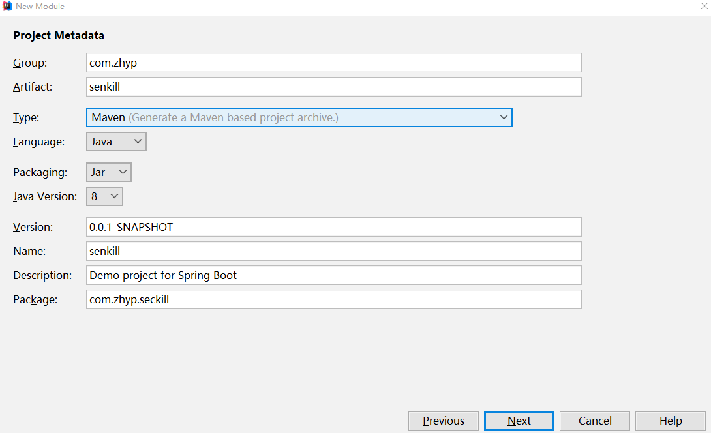

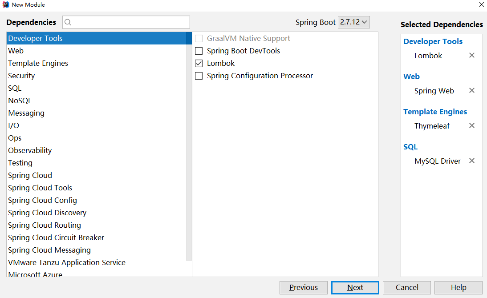

### 2.2 项目结构

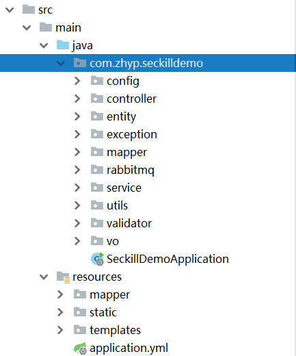

### 2.3 添加依赖

```xml
<!-- 为确保项目稳定性和兼容性 统一使用2.6.4的spring-boot-starter-parent-->
<parent>
    <groupId>org.springframework.boot</groupId>
    <artifactId>spring-boot-starter-parent</artifactId>
    <version>2.6.4</version>
    <relativePath/> <!-- lookup parent from repository -->
</parent>
```

```xml
<!--  统一JDK版本1.8 -->
<properties>
        <java.version>1.8</java.version>
</properties>
<dependencies>
    <!--thymeleaf 整合依赖-->
    <dependency>
        <groupId>org.springframework.boot</groupId>
        <artifactId>spring-boot-starter-thymeleaf</artifactId>
    </dependency>
    <!--SpringMVC整合依赖-->
    <dependency>
        <groupId>org.springframework.boot</groupId>
        <artifactId>spring-boot-starter-web</artifactId>
    </dependency>

    <!--mysql驱动-->
    <dependency>
        <groupId>mysql</groupId>
        <artifactId>mysql-connector-java</artifactId>
        <scope>runtime</scope>
    </dependency>
    <!--myabatis-plus -->
    <dependency>
        <groupId>com.baomidou</groupId>
        <artifactId>mybatis-plus-boot-starter</artifactId>
        <version>3.5.1</version>
    </dependency>

    <!-- md5依赖,用于加密的,登陆用到 -->
    <dependency>
        <groupId>commons-codec</groupId>
        <artifactId>commons-codec</artifactId>
    </dependency>

    <!-- swagger 生成API文档的,后期用到 -->
    <dependency>
        <groupId>io.springfox</groupId>
        <artifactId>springfox-swagger2</artifactId>
        <version>2.9.2</version>
    </dependency>
    <dependency>
        <groupId>io.springfox</groupId>
        <artifactId>springfox-swagger-ui</artifactId>
        <version>2.9.2</version>
        <!-- 排除其中的swagger-models,单独引入1.5.22稳定版本 -->
        <exclusions>
            <exclusion>
                <groupId>io.swagger</groupId>
                <artifactId>swagger-models</artifactId>
            </exclusion>
        </exclusions>
    </dependency>
    <!-- 使用1.5.22-->
    <dependency>
        <groupId>io.swagger</groupId>
        <artifactId>swagger-models</artifactId>
        <version>1.5.22</version>
    </dependency>

    <!--Knife4j 这是swagger的增强工具包-->
    <dependency>
        <groupId>com.github.xiaoymin</groupId>
        <artifactId>knife4j-spring-boot-starter</artifactId>
        <!--在引用时请在maven中央仓库搜索3.X最新版本号-->
        <version>2.0.9</version>
    </dependency>
    <!-- 工具类，涉及到数组工具类，字符串工具类，字符工具类，数学方面，时间日期工具类，异常，事件等工具类 -->
    <dependency>
        <groupId>org.apache.commons</groupId>
        <artifactId>commons-lang3</artifactId>
        <version>3.12.0</version>
    </dependency>
    <!--validation组件,用于前端提交数据后的各种检验-->
    <dependency>
        <groupId>org.springframework.boot</groupId>
        <artifactId>spring-boot-starter-validation</artifactId>
    </dependency>
	
    <dependency>
        <groupId>org.projectlombok</groupId>
        <artifactId>lombok</artifactId>
        <optional>true</optional>
    </dependency>
    <dependency>
        <groupId>org.springframework.boot</groupId>
        <artifactId>spring-boot-starter-test</artifactId>
        <scope>test</scope>
    </dependency>
    <!--Spring Boot Redis 后期使用 -->
    <dependency>
        <groupId>org.springframework.boot</groupId>
        <artifactId>spring-boot-starter-data-redis</artifactId>
    </dependency>

    <!--对象池依赖,与线程池类似,它是一个通用池技术,可以缓冲对象提高性能-->
    <dependency>
        <groupId>org.apache.commons</groupId>
        <artifactId>commons-pool2</artifactId>
    </dependency>
    <!-- 基于Redis的分布式session解决依赖包 --->
    <dependency>
        <groupId>org.springframework.session</groupId>
        <artifactId>spring-session-data-redis</artifactId>
    </dependency>

    <!--amqp,基于amqp协议的消息中间件即RabbitMQ-->
    <dependency>
        <groupId>org.springframework.boot</groupId>
        <artifactId>spring-boot-starter-amqp</artifactId>
    </dependency>

    <!--验证码依赖,用于秒杀时的验证,防止接口被恶意攻击-->
    <dependency>
        <groupId>com.github.whvcse</groupId>
        <artifactId>easy-captcha</artifactId>
        <version>1.6.2</version>
    </dependency>
</dependencies>
```

```xml
<!-- 编译插件别忘了,我们项目需要打包到CentOS中测试的 -->
<plugins>
     <plugin>
     	<groupId>org.springframework.boot</groupId>
     	<artifactId>spring-boot-maven-plugin</artifactId>
     </plugin>
 </plugins>
```

### 2.4 配置文件(yaml)

```yaml
spring:
  # thymeleaf配置
 thymeleaf:
    # 关闭缓存(秒杀一定要关闭缓存,否则页面可能不是最新数据)
   cache: false
  # 数据源配置
 datasource:
   driver-class-name: com.mysql.cj.jdbc.Driver
   url: jdbc:mysql://localhost:3306/seckill?
useUnicode=true&characterEncoding=UTF-8&serverTimezone=Asia/Shanghai
   username: root
   password: root
   hikari:  #mybatis-plus自带的连接池,号称“史上最快连接池”.
      # 连接池名
     pool-name: DateHikariCP
      # 最小空闲连接数
     minimum-idle: 5
      # 空闲连接存活最大时间，默认600000（10分钟）
     idle-timeout: 180000
      # 最大连接数，默认10
     maximum-pool-size: 10
      # 从连接池返回的连接的自动提交
     auto-commit: true
      # 连接最大存活时间，0表示永久存活，默认1800000（30分钟）
     max-lifetime: 1800000
      # 连接超时时间，默认30000（30秒）
     connection-timeout: 30000
      # 测试连接是否可用的查询语句
     connection-test-query: SELECT 1
# Mybatis-plus配置
mybatis-plus:
  #配置Mapper映射文件
 mapper-locations: classpath*:/mapper/*Mapper.xml
  # 配置MyBatis数据返回类型别名（默认别名是类名）
 type-aliases-package: com.zhyp.seckill.pojo
## Mybatis SQL 打印(接口所在的包，不是Mapper.xml所在的包)
logging:
 level:
   com.zhyp.seckill.mapper: debug
```

### 2.5 简单测试

**Controller**

```java
@Controller
@RequestMapping("/test")
public class TestController {
   /**
    * 测试页面跳转
    *
    * @return
    */
   @RequestMapping("/hello")
   public String hello(Model model) {
      model.addAttribute("data", "just test page");
      return "hello";
   }
}
```

**页面(Thymeleaf模板)**

```html
<!DOCTYPE html>
<html lang="en"
      xmlns:th="http://www.thymeleaf.org">
<head>
    <meta charset="UTF-8">
    <title>测试</title>
</head>
<body>
	<p th:text="'hello:'+${name}"></p>
</body>
</html>
```

### 2.6 封装公共结果返回对象

**思考:**

```java
服务器给前端返回的结果,可能包含哪些内容?
    
```

**RespBean返回结果对象**

```java
@Data
@NoArgsConstructor
@AllArgsConstructor
public class RespBean {
 private long code;
 private String message;
 private Object obj;
    
    
 enum RespBeanEnum {
   private final Integer code;
   private final String message;
   //通用状态码
   SUCCESS(200,"success"),
   ERROR(500,"服务端异常"),
   //登录模块5002xx
   SESSION_ERROR(500210,"session不存在或者已经失效"),
   LOGINVO_ERROR(500211,"用户名或者密码错误"),
   MOBILE_ERROR(500212,"手机号码格式错误");

}
 /**
 * 成功返回结果
 */
 public static RespBean success() {
 	return new RespBean(RespBeanEnum.SUCCESS.getCode(), 
                        RespBeanEnum.SUCCESS.getMessage(), null);
 }
 /**
 * 成功返回结果
 *
 * @param obj
 */
 public static RespBean success(Object obj) {
 	return new RespBean(RespBeanEnum.SUCCESS.getCode(), 
						RespBeanEnum.SUCCESS.getMessage(), obj);
 }
 /**
 * 失败返回结果
 *
 * @param respBeanEnum
 * @return
 */
 public static RespBean error(RespBeanEnum respBeanEnum) {
 	return new RespBean(respBeanEnum.getCode(), 
                        respBeanEnum.getMessage(), null);
 }
}
```

## 三.登陆功能

### 3.1 MD5加密

**加密:**

- 是以某种特殊的算法改变原有的信息数据，使得即使非法获得了已加密的信息，但因不知解密的方法，仍然无法了解信息的内容。

- 数据加密的基本过程就是对原来为明文的文件或数据按某种算法进行处理，使其成为不可读的一段代码，通常称为"密文"，使其只能在输入相应的密钥之后才能显示出本来内容，通过这样的途径来达到保护数据不被非法人窃取、阅读的目的。

**常见加密算法**

- **对称加密算法（AES、DES、3DES）**      
  对称加密算法是指加密和解密采用相同的密钥，是可逆的（即可解密）。
  AES加密算法是密码学中的高级加密标准，采用的是对称分组密码体制，密钥长度的最少支持为128。AES加密算法是美国联邦政府采用的区块加密标准，这个标准用来替代原先的DES，已经被多方分析且广为全世界使用。
  AES数学原理详解：https://www.cnblogs.com/block2016/p/5596676.html
  **优点：**加密速度快
  **缺点：**密钥的传递和保存是一个问题，参与加密和解密的双方使用的密钥是一样的，这样密钥就很容易泄露。
- **非对称加密算法（RSA、DSA、ECC）**
  非对称加密算法是指加密和解密采用不同的密钥（公钥和私钥），因此非对称加密也叫公钥加密，它是可逆的（即可解密）。公钥密码体制根据其所依据的难题一般分为三类：大素数分解问题类、离散对数问题类、椭圆曲线类。
  RSA加密算法是基于一个十分简单的数论事实：将两个大素数相乘十分容易，但是想要对其乘积进行因式分解极其困难，因此可以将乘积公开作为加密密钥。虽然RSA的安全性一直未能得到理论上的证明，但它经历了各种攻击至今未被完全攻破。
  **优点：**加密和解密的密钥不一致，公钥是可以公开的，只需保证私钥不被泄露即可，这样就密钥的传递变的简单很多，从而降低了被破解的几率。
  **缺点：**加密速度慢RSA加密算法既可以用来做数据加密，也可以用来数字签名。
  **数据加密过程：**发送者用公钥加密，接收者用私钥解密（只有拥有私钥的接收者才能解读加密的内容）https://blog.csdn.net/weixin_45866849/article/details/120932440 

- **线性散列算法算法（MD5、SHA1、HMAC）**
  MD5全称是Message-Digest Algorithm 5（信息摘要算法5），单向的算法不可逆（被MD5加密的数据不能被解密）。MD5加密后的数据长度要比加密数据小的多，且长度固定，且加密后的串是唯一的。
  适用场景：常用在不可还原的密码存储、信息完整性校验等。
  信息完整性校验：典型的应用是对一段信息产生信息摘要，以防止被篡改。如果再有一个第三方的认证机构，用MD5还可以防止文件作者的“抵赖”，这就是所谓的数字签名应用。
  SHA-1 与 MD5 的比较
  SHA-1摘要比MD5摘要长32 位，所以SHA-1对强行攻击有更大的强度，比MD5更安全。使用强行技术，产生任何一个报文使其摘要等于给定报摘要的难度对MD5是2 160数
  量级的操作。在相同的硬件上，SHA-1 的运行速度比 MD5 慢。
- **混合加密**
  由于以上加密算法都有各自的缺点（RSA加密速度慢、AES密钥存储问题、MD5加密不可逆），因此实际应用时常将几种加密算法混合使用。
  例如：RSA+AES：
  采用RSA加密AES的密钥，采用AES对数据进行加密，这样集成了两种加密算法的优点，既保证了
  数据加密的速度，又实现了安全方便的密钥管理。
  那么，采用多少位的密钥合适呢？一般来讲密钥长度越长，安全性越高，但是加密速度越慢。所以
  密钥长度也要合理的选择，一般RSA建议采用1024位的数字，AES建议采用128位即可。
  https://blog.csdn.net/weixin_45866849/article/details/120932440 3/3
- **Base64**   
  严格意义讲，Base64并不能算是一种加密算法，而是一种编码格式，是网络上最常见的用于传输8字节代码的编码方式之一。
  Base64编码可用于在HTTP环境下传递较长的标识信息，Base编码不仅不仅比较简单，同时也据有不可读性（编码的数据不会被肉眼直接看到）。

**MD5加密工具 - MD5Util.java**

```java
package com.zhyp.seckilldemo.utils;
import org.apache.commons.codec.digest.DigestUtils;
import org.springframework.stereotype.Component;

/**
 * MD5工具类
 */
@Component
public class MD5Util {

    public static String md5(String str) {
        return DigestUtils.md5Hex(str);
    }

    private static final String salt = "1a2b3c4d";

    /**
     * 第一次加密
     **/
    public static String inputPassToFromPass(String inputPass) {
        String str = salt.charAt(0) + salt.charAt(2) + inputPass + salt.charAt(5) + salt.charAt(4);
        return md5(str);
    }

    /**
     * 第二次加密
     **/
    public static String formPassToDBPass(String formPass, String salt) {
        String str = salt.charAt(0) + salt.charAt(2) + formPass + salt.charAt(5) + salt.charAt(4);
        return md5(str);
    }

    public static String inputPassToDBPass(String inputPass, String salt) {
        String fromPass = inputPassToFromPass(inputPass);
        String dbPass = formPassToDBPass(fromPass, salt);
        return dbPass;
    }
}

```

### 3.2 MybatisPlus逆向工程

MybatisPlus提供了根据数据库表逆向生成POJO、Mapper、Service、ServiceImpl、Controller 等类.我们可以使用MybatisPlus提供的AutoGenerator，代码如 下。

具体可去官网查看: https://mybatis.plus/guide/generator.html

```xml
<dependencies>
    <dependency>
        <groupId>org.springframework.boot</groupId>
        <artifactId>spring-boot-starter</artifactId>
    </dependency>

    <dependency>
        <groupId>org.springframework.boot</groupId>
        <artifactId>spring-boot-starter-test</artifactId>
        <scope>test</scope>
    </dependency>
	<!-- mybatis plus 整合依赖 -->
    <dependency>
        <groupId>com.baomidou</groupId>
        <artifactId>mybatis-plus-boot-starter</artifactId>
        <version>3.4.0</version>
    </dependency>
	<!-- mybatis plus 自动代码生成器依赖 -->
    <dependency>
        <groupId>com.baomidou</groupId>
        <artifactId>mybatis-plus-generator</artifactId>
        <version>3.4.0</version>
    </dependency>
	<!-- FreeMarker模板依赖,mybatis plus需要依赖此模板-->
    <dependency>
        <groupId>org.freemarker</groupId>
        <artifactId>freemarker</artifactId>
        <version>2.3.29</version>
    </dependency>
	<!-- 各种工具类, 比如字符串判断等等,在代码生成器中使用到-->
    <dependency>
        <groupId>org.apache.commons</groupId>
        <artifactId>commons-lang3</artifactId>
        <version>3.12.0</version>
    </dependency>
    
    <dependency>
        <groupId>mysql</groupId>
        <artifactId>mysql-connector-java</artifactId>
        <version>8.0.20</version>
    </dependency>
</dependencies>
```


**CodeGenerator 代码生成器**

```java
/**
* 执行 main 方法控制台输入模块表名回车自动生成对应项目目录中
*/
public class CodeGenerator {
   /**
    * <p>
    * 读取控制台内容
    * </p>
    */
   public static String scanner(String tip) {
      Scanner scanner = new Scanner(System.in);
      StringBuilder help = new StringBuilder();
      help.append("请输入" + tip + "：");
      System.out.println(help.toString());
      if (scanner.hasNext()) {
         String ipt = scanner.next();
         if (StringUtils.isNotEmpty(ipt)) {
            return ipt;
         }
     }
      throw new MybatisPlusException("请输入正确的" + tip + "！");
   }
   public static void main(String[] args) {
      // 代码生成器
      AutoGenerator mpg = new AutoGenerator();
      // 全局配置
      GlobalConfig gc = new GlobalConfig();
      String projectPath = System.getProperty("user.dir");
      gc.setOutputDir(projectPath + "/src/main/java");
      //作者
      gc.setAuthor("zhyp");
      //打开输出目录
      gc.setOpen(false);
      //xml开启 BaseResultMap
      gc.setBaseResultMap(true);
      //xml 开启BaseColumnList
      gc.setBaseColumnList(true);
      //日期格式，采用Date
  gc.setDateType(DateType.ONLY_DATE);
      mpg.setGlobalConfig(gc);
      // 数据源配置
      DataSourceConfig dsc = new DataSourceConfig();
      dsc.setUrl("jdbc:mysql://localhost:3306/seckill?
useUnicode=true&characterEncoding=UTF-8&serverTimezone=Asia" +
            "/Shanghai");
      dsc.setDriverName("com.mysql.cj.jdbc.Driver");
      dsc.setUsername("root");
      dsc.setPassword("root");
      mpg.setDataSource(dsc);
      // 包配置
      PackageConfig pc = new PackageConfig();
      pc.setParent("com.zhyp.seckill")
           .setEntity("pojo")
           .setMapper("mapper")
           .setService("service")
           .setServiceImpl("service.impl")
           .setController("controller");
      mpg.setPackageInfo(pc);
      // 自定义配置
      InjectionConfig cfg = new InjectionConfig() {
         @Override
         public void initMap() {
            // to do nothing
            Map<String,Object> map = new HashMap<>();
            map.put("date1","1.0.0");
            this.setMap(map);
         }
     };
      // 如果模板引擎是 freemarker
      String templatePath = "/templates/mapper.xml.ftl";
      // 自定义输出配置
      List<FileOutConfig> focList = new ArrayList<>();
      // 自定义配置会被优先输出
      focList.add(new FileOutConfig(templatePath) {
         @Override
         public String outputFile(TableInfo tableInfo) {
            // 自定义输出文件名 ， 如果你 Entity 设置了前后缀、此处注意 xml 的名称会跟着发生变化！！
            return projectPath + "/src/main/resources/mapper/" +
tableInfo.getEntityName() + "Mapper"
                  + StringPool.DOT_XML;
         }
     });
      cfg.setFileOutConfigList(focList);
      mpg.setCfg(cfg);
      // 配置模板
      TemplateConfig templateConfig = new TemplateConfig()
           .setEntity("templates/entity2.java")
           .setMapper("templates/mapper2.java")
           .setService("templates/service2.java")
           .setServiceImpl("templates/serviceImpl2.java")
           .setController("templates/controller2.java");
      templateConfig.setXml(null);
      mpg.setTemplate(templateConfig);
       / 策略配置
      StrategyConfig strategy = new StrategyConfig();
      //数据库表映射到实体的命名策略
      strategy.setNaming(NamingStrategy.underline_to_camel);
      //数据库表字段映射到实体的命名策略
      strategy.setColumnNaming(NamingStrategy.underline_to_camel);
      //lombok模型
      strategy.setEntityLombokModel(true);
      //生成 @RestController 控制器
      // strategy.setRestControllerStyle(true);
      strategy.setInclude(scanner("表名，多个英文逗号分割").split(","));
      strategy.setControllerMappingHyphenStyle(true);
      //表前缀
      strategy.setTablePrefix("t_");
      mpg.setStrategy(strategy);
      mpg.setTemplateEngine(new FreemarkerTemplateEngine());
      mpg.execute();
   }
}
```

### 3.3 ValidatorUtil 校验工具

```java
/**
* 校验工具类
*/
public class ValidatorUtil {
   private static final Pattern mobile_pattern = 
       Pattern.compile("[1]([3-9])[0-9]{9}$");
   public static boolean isMobile(String mobile){
      if (StringUtils.isEmpty(mobile)) {
         return false;
      }
      Matcher matcher = mobile_pattern.matcher(mobile);
      return matcher.matches();
   }
}
```

### 3.4 LoginController 登陆

#### 3.4.1 LoginController

```java
/**
* 登录
*/
@Controller
@RequestMapping("/login")
@Slf4j
public class LoginController {
   @Autowired
   private IUserService userService;
   /**
    * 跳转登录页
    * @return
    */
   @RequestMapping("/toLogin")
   public String toLogin() {
      return "login";
   }
   /**
    * 登录
    * @return
    */
   @RequestMapping("/doLogin")
   @ResponseBody
   public RespBean doLogin(LoginVo loginVo) {
      log.info(loginVo.toString());
      return userService.login(loginVo);
   }
}
```

####  3.4.2 IUserService

```java
/**
* 服务类
*/
public interface IUserService extends IService<User> {
     /**
     * 登录
     * @param loginVo
     * @return
     */
     RespBean login(LoginVo loginVo);
}
```

#### 3.4.3 UserServiceImpl 

```java
/**
* 服务实现类
*/
@Service
public class UserServiceImpl extends 
    ServiceImpl<UserMapper, User> implements IUserService {
    
   @Autowired
   private UserMapper userMapper;
    /**
    * 登录
    * @param loginVo
    * @return
    */
   @Override
   public RespBean login(LoginVo loginVo) {
      String mobile = loginVo.getMobile();
      String password = loginVo.getPassword();
      if (StringUtils.isEmpty(mobile)||StringUtils.isEmpty(password))
      {
         return RespBean.error(RespBeanEnum.LOGINVO_ERROR);
      }
      if (!ValidatorUtil.isMobile(mobile)){
         return RespBean.error(RespBeanEnum.MOBILE_ERROR);
      }
      //根据手机号获取用户
      User user = userMapper.selectById(mobile);
      if (null==user){
         return RespBean.error(RespBeanEnum.LOGINVO_ERROR);
      }
      //校验密码
      if(!MD5Util.formPassToDBPass(password,user.getSalt())
 .equals(user.getPassword())){
         return RespBean.error(RespBeanEnum.LOGINVO_ERROR);
     }
      return RespBean.success();
   }
}
```

#### 3.4.4 login.html

```html
<!DOCTYPE html>
<html lang="en"
      xmlns:th="http://www.thymeleaf.org">
	<head>
    	<meta charset="UTF-8">
    	<title>登录</title>
    	<!-- jquery -->
    	<script type="text/javascript" th:src="@{/js/jquery.min.js}"></script>
    	<!-- bootstrap -->
    	<link rel="stylesheet" type="text/css"
th:href="@{/bootstrap/css/bootstrap.min.css}"/>
    	<script type="text/javascript" th:src="@{/bootstrap/js/bootstrap.min.js}">
</script>
    <!-- jquery-validator -->
    <script type="text/javascript" th:src="@{/jquery-validation/jquery.validate.min.js}"></script>
    <script type="text/javascript" th:src="@{/jquery-validation/localization/messages_zh.min.js}"></script>
    <!-- layer -->
    <script type="text/javascript" th:src="@{/layer/layer.js}"></script>
    <!-- md5.js -->
    <script type="text/javascript" th:src="@{/js/md5.min.js}"></script>
    <!-- common.js -->
    <script type="text/javascript" th:src="@{/js/common.js}"></script>
    <form name="loginForm" id="loginForm" method="post" style="width:50%; margin:0 
auto">
    <h2 style="text-align:center; margin-bottom: 20px">用户登录</h2>
    <div class="form-group">
        <div class="row">
            <label class="form-label col-md-4">请输入手机号码</label>
            <div class="col-md-5">
                <input id="mobile" name="mobile" class="form-control"
type="text" placeholder="手机号码" required="true"
                       minlength="11" maxlength="11"/>
            </div>
            <div class="col-md-1">
            </div>
        </div>
    </div>
    <div class="form-group">
        <div class="row">
            <label class="form-label col-md-4">请输入密码</label>
            <div class="col-md-5">
                <input id="password" name="password" class="form-control"
type="password" placeholder="密码"
                       required="true" minlength="6" maxlength="16"/>
            </div>
        </div>
    </div>
    <div class="row">
        <div class="col-md-5">
            <button class="btn btn-primary btn-block" type="reset"
onclick="reset()">重置</button>
        </div>
        <div class="col-md-5">
            <button class="btn btn-primary btn-block" type="submit"
onclick="login()">登录</button>
        </div>
    </div>
</form>
</body>
<script>
    function login() {
        $("#loginForm").validate({
            submitHandler: function (form) {
                doLogin();
           }
       });
   }
    function doLogin() {
        g_showLoading();
        var inputPass = $("#password").val();
        var salt = g_passsword_salt;
             var str = "" + salt.charAt(0) + salt.charAt(2) + inputPass +
salt.charAt(5) + salt.charAt(4);
        var password = md5(str);
        $.ajax({
            url: "/login/doLogin",
            type: "POST",
            data: {
                mobile: $("#mobile").val(),
                password: password
           },
            success: function (data) {
                layer.closeAll();
                if (data.code == 200) {
                    layer.msg("成功");
               } else {
                    layer.msg(data.message);
               }
           },
            error: function () {
                layer.closeAll();
           }
       });
   }
</script>
</html>
```

#### 3.4.5 测试

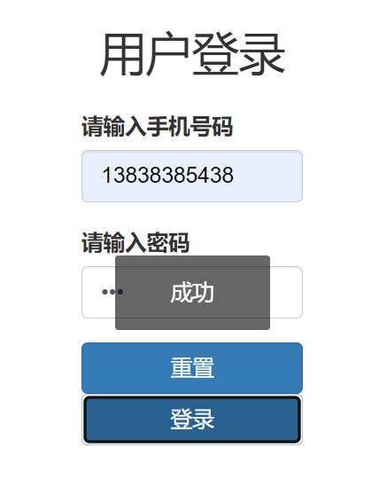

#### 3.4.6 参数校验

**每个类都写大量的健壮性判断过于麻烦，我们可以使用 validation 简化我们的代码** 

```xml
<!-- validation组件 --> 
<dependency>
	<groupId>org.springframework.boot</groupId>
	<artifactId>spring-boot-starter-validation</artifactId>
</dependency>
```

**自定义手机号码验证规则**

 ```java
/**
* 手机号码验证规则
*/
public class IsMobileValidator implements ConstraintValidator<IsMobile,String> {
   private boolean required = false;
   @Override
   public void initialize(IsMobile constraintAnnotation) {
      required = constraintAnnotation.required();
   }
   @Override
   public boolean isValid(String value, ConstraintValidatorContext context) {
      if (required){
         return ValidatorUtil.isMobile(value);
     }else {
         if (StringUtils.isEmpty(value)){
            return true;
         }else {
            return ValidatorUtil.isMobile(value);
         }
     }
   }
}
 ```

**自定义注解**

```java
/**
* 验证手机号
*
* @author zhoubin
* @since 1.0.0
*/
@Target({METHOD, FIELD, ANNOTATION_TYPE, CONSTRUCTOR, PARAMETER, TYPE_USE})
@Retention(RUNTIME)
@Documented
@Constraint(validatedBy = {IsMobileValidator.class})
public @interface IsMobile {
   boolean required() default true;
   String message() default "手机号码格式错误";
   Class<?>[] groups() default {};
   Class<? extends Payload>[] payload() default {};
}
```

**修改LoginVo**

```java
/**
* 登录入参
*/
@Data
@NoArgsConstructor
@AllArgsConstructor
public class LoginVo {
   @NotNull
   @IsMobile
   private String mobile;
   @NotNull
   @Length(min = 32)
   private String password;
}
```

**其他修改**

-  LoginController 入参添加 @Valid

```java
/**
* 登录
* @return
*/
@RequestMapping("/doLogin")
@ResponseBody
public RespBean doLogin(@Valid LoginVo loginVo) {
   log.info(loginVo.toString());
   return userService.login(loginVo);
}
```

**UserServiceImpl** 

- 注释掉之前的健壮性判断即可

```java
/**
* 登录
*/
@Override
public RespBean login(LoginVo loginVo) {
   String mobile = loginVo.getMobile();
   String password = loginVo.getPassword();
   // if (StringUtils.isEmpty(mobile)||StringUtils.isEmpty(password)){
   //     return RespBean.error(RespBeanEnum.LOGINVO_ERROR);
   // }
   // if (!ValidatorUtil.isMobile(mobile)){
   //     return RespBean.error(RespBeanEnum.MOBILE_ERROR);
   // }
   //根据手机号获取用户
   User user = userMapper.selectById(mobile);
   if (null==user){
      return RespBean.error(RespBeanEnum.LOGINVO_ERROR);
   }
   //校验密码
   if(!MD5Util.formPassToDBPass(password,user.getSalt())
 .equals(user.getPassword())){
      return RespBean.error(RespBeanEnum.LOGINVO_ERROR);
   }
   return RespBean.success();
}    
```

**重写测试**


#### 3.4.7 异常处理

- 我们知道，系统中异常包括：编译时异常和运行时异常 RuntimeException ，前者通过捕获异常从而获 取异常信息，后者主要通过规范代码开发、测试通过手段减少运行时异常的发生。

- 在开发中，不管是 dao层、service层还是controller层，都有可能抛出异常，在Springmvc中，能将所有类型的异常处理,从各处理过程解耦出来，既保证了相关处理过程的功能较单一，也实现了异常信息的统一处理和维护。 

**SpringBoot全局异常处理方式主要两种：**

- 使用 @ControllerAdvice 和 @ExceptionHandler 注解。
-  使用 ErrorController类 来实现

**区别：** 

- @ControllerAdvice 方式只能处理控制器抛出的异常。此时请求已经进入控制器中。 

-  ErrorController类 方式可以处理所有的异常，包括未进入控制器的错误，比如404,401等错误 

-  如果应用中两者共同存在，则 @ControllerAdvice 方式处理控制器抛出的异常,ErrorController类 方式处理未进入控制器的异常。 

- @ControllerAdvice 方式可以定义多个拦截方法，拦截不同的异常类，并且可以获取抛出的异常 信息，自由度更大。

**GlobalException** 

 ```java
/**
 * 全局异常
 */
public class GlobalException extends RuntimeException {

    private RespBeanEnum respBeanEnum;

    public RespBeanEnum getRespBeanEnum() {
        return respBeanEnum;
    }

    public void setRespBeanEnum(RespBeanEnum respBeanEnum) {
        this.respBeanEnum = respBeanEnum;
    }

    public GlobalException(RespBeanEnum respBeanEnum) {
        this.respBeanEnum = respBeanEnum;
    }
}

 ```

**GlobalExceptionHandler** 

```java
/**
 * 全局异常处理类
 */
@RestControllerAdvice
public class GlobalExceptionHandler {

    @ExceptionHandler(Exception.class)
    public RespBean ExceptionHandler(Exception e) {
        if (e instanceof GlobalException) {
            GlobalException exception = (GlobalException) e;
            return RespBean.error(exception.getRespBeanEnum());
        } else if (e instanceof BindException) {
            BindException bindException = (BindException) e;
            RespBean respBean = RespBean.error(RespBeanEnum.BIND_ERROR);
            respBean.setMessage("参数校验异常：" + bindException.getBindingResult().getAllErrors().get(0).getDefaultMessage());
            return respBean;
        }
        System.out.println("异常信息" + e);
        return RespBean.error(RespBeanEnum.ERROR);
    }
}
```

**修改之前代码**

- 直接返回RespBean改为直接抛 GlobalException 异常

```java
/**
* 登录
*/
@Override
public RespBean login(LoginVo loginVo) {
   String mobile = loginVo.getMobile();
   String password = loginVo.getPassword();
   //根据手机号获取用户
   User user = userMapper.selectById(mobile);
   if (null==user){
      throw new GlobalException(RespBeanEnum.LOGINVO_ERROR);
   }
   //校验密码
   if
(!MD5Util.formPassToDBPass(password,user.getSalt()).equals(user.getPassword())){
      throw new GlobalException(RespBeanEnum.LOGINVO_ERROR);
   }
   return RespBean.success();
}
```

**测试** 

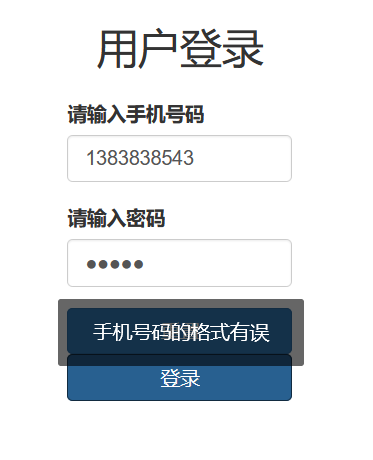

## 四.分布式Session

### 4.1 完善登录功能

- 使用cookie+session记录用户信息

- 准备工具类 CookieUtil.java

```java
package com.zhyp.seckilldemo.utils;

import javax.servlet.http.Cookie;
import javax.servlet.http.HttpServletRequest;
import javax.servlet.http.HttpServletResponse;
import java.io.UnsupportedEncodingException;
import java.net.URLDecoder;
import java.net.URLEncoder;

/**
 * Cookie工具类
 */
public final class CookieUtil {

    /**
     * 得到Cookie的值, 不编码
     *
     * @param request
     * @param cookieName
     * @return
     */
    public static String getCookieValue(HttpServletRequest request, String cookieName) {
        return getCookieValue(request, cookieName, false);
    }

    /**
     * 得到Cookie的值,
     *
     * @param request
     * @param cookieName
     * @return
     */
    public static String getCookieValue(HttpServletRequest request, String cookieName, boolean isDecoder) {
        Cookie[] cookieList = request.getCookies();
        if (cookieList == null || cookieName == null) {
            return null;
        }
        String retValue = null;
        try {
            for (int i = 0; i < cookieList.length; i++) {
                if (cookieList[i].getName().equals(cookieName)) {
                    if (isDecoder) {
                        retValue = URLDecoder.decode(cookieList[i].getValue(), "UTF-8");
                    } else {
                        retValue = cookieList[i].getValue();
                    }
                    break;
                }
            }
        } catch (UnsupportedEncodingException e) {
            e.printStackTrace();
        }
        return retValue;
    }

    /**
     * 得到Cookie的值,
     *
     * @param request
     * @param cookieName
     * @return
     */
    public static String getCookieValue(HttpServletRequest request, String cookieName, String encodeString) {
        Cookie[] cookieList = request.getCookies();
        if (cookieList == null || cookieName == null) {
            return null;
        }
        String retValue = null;
        try {
            for (int i = 0; i < cookieList.length; i++) {
                if (cookieList[i].getName().equals(cookieName)) {
                    retValue = URLDecoder.decode(cookieList[i].getValue(), encodeString);
                    break;
                }
            }
        } catch (UnsupportedEncodingException e) {
            e.printStackTrace();
        }
        return retValue;
    }

    /**
     * 设置Cookie的值 不设置生效时间默认浏览器关闭即失效,也不编码
     */
    public static void setCookie(HttpServletRequest request, HttpServletResponse response, String cookieName,
                                 String cookieValue) {
        setCookie(request, response, cookieName, cookieValue, -1);
    }

    /**
     * 设置Cookie的值 在指定时间内生效,但不编码
     */
    public static void setCookie(HttpServletRequest request, HttpServletResponse response, String cookieName,
                                 String cookieValue, int cookieMaxage) {
        setCookie(request, response, cookieName, cookieValue, cookieMaxage, false);
    }

    /**
     * 设置Cookie的值 不设置生效时间,但编码
     */
    public static void setCookie(HttpServletRequest request, HttpServletResponse response, String cookieName,
                                 String cookieValue, boolean isEncode) {
        setCookie(request, response, cookieName, cookieValue, -1, isEncode);
    }

    /**
     * 设置Cookie的值 在指定时间内生效, 编码参数
     */
    public static void setCookie(HttpServletRequest request, HttpServletResponse response, String cookieName,
                                 String cookieValue, int cookieMaxage, boolean isEncode) {
        doSetCookie(request, response, cookieName, cookieValue, cookieMaxage, isEncode);
    }

    /**
     * 设置Cookie的值 在指定时间内生效, 编码参数(指定编码)
     */
    public static void setCookie(HttpServletRequest request, HttpServletResponse response, String cookieName,
                                 String cookieValue, int cookieMaxage, String encodeString) {
        doSetCookie(request, response, cookieName, cookieValue, cookieMaxage, encodeString);
    }

    /**
     * 删除Cookie带cookie域名
     */
    public static void deleteCookie(HttpServletRequest request, HttpServletResponse response,
                                    String cookieName) {
        doSetCookie(request, response, cookieName, "", -1, false);
    }

    /**
     * 设置Cookie的值，并使其在指定时间内生效
     *
     * @param cookieMaxage cookie生效的最大秒数
     */
    private static final void doSetCookie(HttpServletRequest request, HttpServletResponse response,
                                          String cookieName, String cookieValue, int cookieMaxage, boolean isEncode) {
        try {
            if (cookieValue == null) {
                cookieValue = "";
            } else if (isEncode) {
                cookieValue = URLEncoder.encode(cookieValue, "utf-8");
            }
            Cookie cookie = new Cookie(cookieName, cookieValue);
            if (cookieMaxage > 0)
                cookie.setMaxAge(cookieMaxage);
            if (null != request) {// 设置域名的cookie
                String domainName = getDomainName(request);
                System.out.println(domainName);
                if (!"localhost".equals(domainName)) {
                    cookie.setDomain(domainName);
                }
            }
            cookie.setPath("/");
            response.addCookie(cookie);
        } catch (Exception e) {
            e.printStackTrace();
        }
    }

    /**
     * 设置Cookie的值，并使其在指定时间内生效
     *
     * @param cookieMaxage cookie生效的最大秒数
     */
    private static final void doSetCookie(HttpServletRequest request, HttpServletResponse response,
                                          String cookieName, String cookieValue, int cookieMaxage, String encodeString) {
        try {
            if (cookieValue == null) {
                cookieValue = "";
            } else {
                cookieValue = URLEncoder.encode(cookieValue, encodeString);
            }
            Cookie cookie = new Cookie(cookieName, cookieValue);
            if (cookieMaxage > 0) {
                cookie.setMaxAge(cookieMaxage);
            }
            if (null != request) {// 设置域名的cookie
                String domainName = getDomainName(request);
                System.out.println(domainName);
                if (!"localhost".equals(domainName)) {
                    cookie.setDomain(domainName);
                }
            }
            cookie.setPath("/");
            response.addCookie(cookie);
        } catch (Exception e) {
            e.printStackTrace();
        }
    }

    /**
     * 得到cookie的域名
     */
    private static final String getDomainName(HttpServletRequest request) {
        String domainName = null;
        // 通过request对象获取访问的url地址
        String serverName = request.getRequestURL().toString();
        if (serverName == null || serverName.equals("")) {
            domainName = "";
        } else {
            // 将url地下转换为小写
            serverName = serverName.toLowerCase();
            // 如果url地址是以http://开头  将http://截取
            if (serverName.startsWith("http://")) {
                serverName = serverName.substring(7);
            }
            int end = serverName.length();
            // 判断url地址是否包含"/"
            if (serverName.contains("/")) {
                //得到第一个"/"出现的位置
                end = serverName.indexOf("/");
            }

            // 截取
            serverName = serverName.substring(0, end);
            // 根据"."进行分割
            final String[] domains = serverName.split("\\.");
            int len = domains.length;
            if (len > 3) {
                // www.xxx.com.cn
                domainName = domains[len - 3] + "." + domains[len - 2] + "." + domains[len - 1];
            } else if (len <= 3 && len > 1) {
                // xxx.com or xxx.cn
                domainName = domains[len - 2] + "." + domains[len - 1];
            } else {
                domainName = serverName;
            }
        }

        if (domainName != null && domainName.indexOf(":") > 0) {
            String[] ary = domainName.split("\\:");
            domainName = ary[0];
        }
        return domainName;
    }
}

```

- **UUID工具类**

```java
package com.zhyp.seckilldemo.utils;

import java.util.UUID;

/**
 * UUID工具类
 */
public class UUIDUtil {

    public static String uuid() {
        return UUID.randomUUID().toString().replace("-", "");
    }
}

```

- **IUserService** 

```java
/**
 * 用户表 服务类
 */
public interface ITUserService extends IService<TUser> {

    /**
     * 登录方法
     *
     * @param loginVo
     * @param request
     * @param response
     * @return RespBean
     **/
    RespBean doLongin(LoginVo loginVo, HttpServletRequest request, HttpServletResponse response);
}
```

- **UserServiceImpl**

```java
/**
 * 用户表 服务实现类
 */
@Service
@Primary
public class TUserServiceImpl extends ServiceImpl<TUserMapper, TUser> implements ITUserService {
    @Autowired
    private TUserMapper tUserMapper;
    @Autowired
    private RedisTemplate redisTemplate;

    @Override
    public RespBean doLongin(LoginVo loginVo, HttpServletRequest request, HttpServletResponse response) {
        String mobile = loginVo.getMobile();
        String password = loginVo.getPassword();
        //参数校验
//        if (StringUtils.isEmpty(mobile) || StringUtils.isEmpty(password)) {
//            throw new GlobalException(RespBeanEnum.LOGIN_ERROR);
//        }
        //TODO 测试的时候，把手机号码和密码长度校验去掉了，可以打开。页面和实体类我也注释了，记得打开
//        if (!ValidatorUtil.isMobile(mobile)) {
//            return RespBean.error(RespBeanEnum.MOBILE_ERROR);
//        }

        TUser user = tUserMapper.selectById(mobile);
        if (user == null) {
            throw new GlobalException(RespBeanEnum.LOGIN_ERROR);
        }
//        System.out.println(MD5Util.formPassToDBPass(password, user.getSalt()));
        //判断密码是否正确
        if (!MD5Util.formPassToDBPass(password, user.getSalt()).equals(user.getPassword())) {
            throw new GlobalException(RespBeanEnum.LOGIN_ERROR);
        }
        //生成Cookie
        String userTicket = UUIDUtil.uuid();

		request.getSession().setAttribute(userTicket, user);
        CookieUtil.setCookie(request, response, "userTicket", userTicket);
        return RespBean.success(userTicket);

    }
}
```

- **LoginController**

```java
package com.zhyp.seckilldemo.controller;

import com.zhyp.seckilldemo.service.ITUserService;
import com.zhyp.seckilldemo.vo.LoginVo;
import com.zhyp.seckilldemo.vo.RespBean;
import io.swagger.annotations.Api;
import io.swagger.annotations.ApiOperation;
import lombok.extern.slf4j.Slf4j;
import org.springframework.beans.factory.annotation.Autowired;
import org.springframework.stereotype.Controller;
import org.springframework.web.bind.annotation.RequestMapping;
import org.springframework.web.bind.annotation.RequestMethod;
import org.springframework.web.bind.annotation.ResponseBody;

import javax.servlet.http.HttpServletRequest;
import javax.servlet.http.HttpServletResponse;
import javax.validation.Valid;

@Controller
@RequestMapping("/login")
@Slf4j
@Api(value = "登录", tags = "登录")
public class LoginController {
    @Autowired
    private ITUserService tUserService;
    /**
     * 跳转登录页面
     **/
    @ApiOperation("跳转登录页面")
    @RequestMapping(value = "/toLogin", method = RequestMethod.GET)
    public String toLogin() {
        return "login";
    }

    
    @ApiOperation("登录接口")
    @RequestMapping(value = "/doLogin", method = RequestMethod.POST)
    @ResponseBody
    public RespBean doLogin(@Valid LoginVo loginVo, HttpServletRequest request, HttpServletResponse response) {
        log.info("{}", loginVo);
        return tUserService.doLongin(loginVo, request, response);
    }
}
```

- **GoodsController**

```java
@Controller
@RequestMapping("/goods")
public class GoodsController {
    /**
     * 跳转登录页
     *
     * @return
     */
    @RequestMapping("/toList")
    public String toLogin(HttpSession session, Model model, 
                          @CookieValue("userTicket") String ticket) {
        if (StringUtils.isEmpty(ticket)) {
            return "login";
        }
        User user = (User) session.getAttribute(ticket);
        if (null == user) {
            return "login";
        }
        model.addAttribute("user", user);
        return "goodsList";
    }
}
```

- **login.html**

```javascript
$.ajax({
    url: "/login/doLogin",
    type: "POST",
    data: {
        mobile: $("#mobile").val(),
        password: password
   },
    success: function (data) {
        layer.closeAll();
        if (data.code == 200) {
            layer.msg("成功");
            window.location.href = "/goods/toList";
       } else {
            layer.msg(data.message);
       }
   },
    error: function () {
        layer.closeAll();
   }
});
```

- goodsList.html 

```html
<!DOCTYPE html>
<html lang="en"
      xmlns:th="http://www.thymeleaf.org">
    <head>
        <meta charset="UTF-8">
        <title>商品列表</title>
    </head>
    <body>
        <p th:text="'hello:'+${user.nickname}"></p>
    </body>
</html>
```

- 测试


### 4.2 分布式Session

- 之前的代码在我们之后一台应用系统，所有操作都在一台Tomcat上，没有什么问题。当我们部署多台 系统，配合Nginx的时候会出现用户登录的问题 

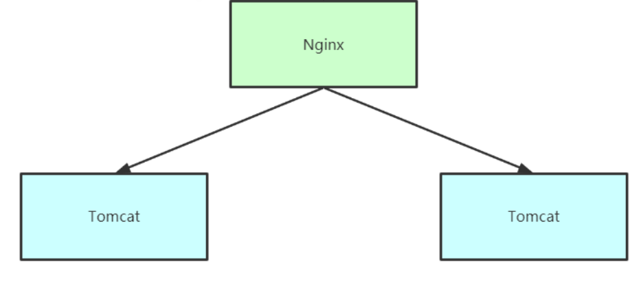

#### 4.2.1 分布式Session解决方案

  ```java
1.Session复制
	优点
		无需修改代码，只需要修改Tomcat配置
	缺点
		Session同步传输占用内网带宽
		多台Tomcat同步性能指数级下降
		Session占用内存，无法有效水平扩展
2.前端存储
	优点
		不占用服务端内存
	缺点
		存在安全风险
		数据大小受cookie限制 
		占用外网带宽
3.Session粘滞
	优点
		无需修改代码
		服务端可以水平扩展
	缺点
		增加新机器，会重新Hash，导致重新登录
		应用重启，需要重新登录
4.后端集中存储
	优点
		安全
		容易水平扩展
	缺点
		增加复杂度
		需要修改代码
  ```

#### 4.2.2 使用Redis实现分布式Session

- 下载Redis 编译安装 并修改配置

```java
1.下载地址
	http://redis.io/
2.解压
	tar zxvf redis-5.0.3.tar.gz
3.安装依赖
	yum -y install gcc-c++ autoconf automake
4.编译
	cd redis-5.0.5/
    make
6.安装
	#创建安装目录
	mkdir -p /usr/local/redis
	#安装
	make PREFIX=/usr/local/redis/ install
7.修改配置文件
	#复制redis.conf至安装路径下
	cp redis.conf /usr/local/redis/bin/
	#修改配置文件
	vim /usr/local/redis/bin/redis.conf	
	
    #可以使所有ip访问redis
        bind 0.0.0.0
    #关闭保护模式
        protected-mode no
    #后台启动
        daemonize yes
    #添加访问认证
        requirepass root
8.启动Redis 并使用配置文件
	./redis-server redis.conf
```

#### 4.2.3 Redis实现分布式Session

- **方法一：使用SpringSession实现**

**添加依赖**

```xml
<!-- spring data redis 依赖 -->
<dependency>
	<groupId>org.springframework.boot</groupId>
	<artifactId>spring-boot-starter-data-redis</artifactId>
</dependency>
<!-- commons-pool2 对象池依赖 -->
<dependency>
	<groupId>org.apache.commons</groupId>
	<artifactId>commons-pool2</artifactId>
</dependency>
<!-- spring-session 依赖 -->
<dependency>
	<groupId>org.springframework.session</groupId>
	<artifactId>spring-session-data-redis</artifactId>
</dependency>
```

**添加配置**

```yaml
spring:
 redis:
    #超时时间
   timeout: 10000ms
    #服务器地址
   host: 192.168.10.100
    #服务器端口
   port: 6379
    #数据库
   database: 0
    #密码
   password: root
   lettuce:
     pool:
        #最大连接数，默认8
       max-active: 1024
        #最大连接阻塞等待时间，默认-1
       max-wait: 10000ms
        #最大空闲连接
       max-idle: 200
        #最小空闲连接
       min-idle: 5
```

**测试** 

其余代码暂时不动，重新登录测试。会发现session已经存储在Redis上 

- **方法二：将用户信息存入Redis**

**添加依赖**

```xml
<!-- spring data redis 依赖 -->
<dependency>
	<groupId>org.springframework.boot</groupId>
	<artifactId>spring-boot-starter-data-redis</artifactId>
</dependency>
<!-- commons-pool2 对象池依赖 -->
<dependency>
	<groupId>org.apache.commons</groupId>
	<artifactId>commons-pool2</artifactId>
</dependency
```

**添加配置**

```yaml
spring:
 redis:
    #超时时间
   timeout: 10000ms
    #服务器地址
   host: 192.168.10.100
    #服务器端口
   port: 6379
    #数据库
   database: 0
    #密码
   password: root
   lettuce:
     pool:
        #最大连接数，默认8
       max-active: 1024
        #最大连接阻塞等待时间，默认-1
       max-wait: 10000ms
       #最大空闲连接
       max-idle: 200
        #最小空闲连接
       min-idle: 5
```

**RedisConfig**

```java
package com.zhyp.seckilldemo.config;

import org.springframework.context.annotation.Bean;
import org.springframework.context.annotation.Configuration;
import org.springframework.core.io.ClassPathResource;
import org.springframework.data.redis.connection.RedisConnectionFactory;
import org.springframework.data.redis.core.RedisTemplate;
import org.springframework.data.redis.core.script.DefaultRedisScript;
import org.springframework.data.redis.serializer.GenericJackson2JsonRedisSerializer;
import org.springframework.data.redis.serializer.StringRedisSerializer;

/**
 * Redis配置类
 */
@Configuration
public class RedisConfig {

    @Bean
    public RedisTemplate<String, Object> redisTemplate(RedisConnectionFactory redisConnectionFactory) {
        RedisTemplate<String, Object> redisTemplate = new RedisTemplate<>();
        //key序列化
        redisTemplate.setKeySerializer(new StringRedisSerializer());
        //value序列化
        redisTemplate.setValueSerializer(new GenericJackson2JsonRedisSerializer());
        //hash类型value序列化
        redisTemplate.setHashKeySerializer(new StringRedisSerializer());
        redisTemplate.setHashValueSerializer(new GenericJackson2JsonRedisSerializer());

        //注入连接工厂
        redisTemplate.setConnectionFactory(redisConnectionFactory);
        return redisTemplate;
    }
}
```

**工具类 JsonUtil.java**

```java
package com.zhyp.seckilldemo.utils;

import com.fasterxml.jackson.core.JsonParseException;
import com.fasterxml.jackson.core.JsonProcessingException;
import com.fasterxml.jackson.databind.JavaType;
import com.fasterxml.jackson.databind.JsonMappingException;
import com.fasterxml.jackson.databind.ObjectMapper;

import java.io.IOException;
import java.util.List;

/**
 * Json工具类
 */
public class JsonUtil {
    private static ObjectMapper objectMapper = new ObjectMapper();

    /**
     * 将对象转换成json字符串
     */
    public static String object2JsonStr(Object obj) {
        try {
            return objectMapper.writeValueAsString(obj);
        } catch (JsonProcessingException e) {
            //打印异常信息
            e.printStackTrace();
        }
        return null;
    }

    /**
     * 将字符串转换为对象
     */
    public static <T> T jsonStr2Object(String jsonStr, Class<T> clazz) {
        try {
            return objectMapper.readValue(jsonStr.getBytes("UTF-8"), clazz);
        } catch (JsonParseException e) {
            e.printStackTrace();
        } catch (JsonMappingException e) {
            e.printStackTrace();
        } catch (IOException e) {
            e.printStackTrace();
        }
        return null;
    }

    /**
     * 将json数据转换成pojo对象list
     */
    public static <T> List<T> jsonToList(String jsonStr, Class<T> beanType) {
        JavaType javaType = objectMapper.getTypeFactory().constructParametricType(List.class, beanType);
        try {
            List<T> list = objectMapper.readValue(jsonStr, javaType);
            return list;
        } catch (Exception e) {
            e.printStackTrace();
        }

        return null;
    }
}

```

修改代码 

**IUserService.java**

```java
package com.zhyp.seckilldemo.service;

import com.baomidou.mybatisplus.extension.service.IService;
import com.zhyp.seckilldemo.entity.TUser;
import com.zhyp.seckilldemo.vo.LoginVo;
import com.zhyp.seckilldemo.vo.RespBean;

import javax.servlet.http.HttpServletRequest;
import javax.servlet.http.HttpServletResponse;

/**
 * 用户表 服务类
 */
public interface ITUserService extends IService<TUser> {

    /**
     * 登录方法
     **/
    RespBean doLongin(LoginVo loginVo, HttpServletRequest request, HttpServletResponse response);

    /**
     * 根据cookie获取用户
     **/
    TUser getUserByCookie(String userTicket, HttpServletRequest request, HttpServletResponse response);

}
```

**UserServiceImpl.java** 

 ```java
package com.zhyp.seckilldemo.service.impl;


import com.baomidou.mybatisplus.extension.service.impl.ServiceImpl;
import com.zhyp.seckilldemo.entity.TUser;
import com.zhyp.seckilldemo.exception.GlobalException;
import com.zhyp.seckilldemo.mapper.TUserMapper;
import com.zhyp.seckilldemo.service.ITUserService;
import com.zhyp.seckilldemo.utils.CookieUtil;
import com.zhyp.seckilldemo.utils.MD5Util;
import com.zhyp.seckilldemo.utils.UUIDUtil;
import com.zhyp.seckilldemo.vo.LoginVo;
import com.zhyp.seckilldemo.vo.RespBean;
import com.zhyp.seckilldemo.vo.RespBeanEnum;
import org.springframework.beans.factory.annotation.Autowired;
import org.springframework.context.annotation.Primary;
import org.springframework.data.redis.core.RedisTemplate;
import org.springframework.stereotype.Service;
import org.thymeleaf.util.StringUtils;

import javax.servlet.http.HttpServletRequest;
import javax.servlet.http.HttpServletResponse;


/**
 * <p>
 * 用户表 服务实现类
 * </p>
 *
 * @author LiChao
 * @since 2022-03-02
 */
@Service
@Primary
public class TUserServiceImpl extends ServiceImpl<TUserMapper, TUser> implements ITUserService {


    @Autowired
    private TUserMapper tUserMapper;

    @Autowired
    private RedisTemplate redisTemplate;

    @Override
    public RespBean doLongin(LoginVo loginVo, HttpServletRequest request, HttpServletResponse response) {
        String mobile = loginVo.getMobile();
        String password = loginVo.getPassword();
        //参数校验
//        if (StringUtils.isEmpty(mobile) || StringUtils.isEmpty(password)) {
//            throw new GlobalException(RespBeanEnum.LOGIN_ERROR);
//        }

//        if (!ValidatorUtil.isMobile(mobile)) {
//            return RespBean.error(RespBeanEnum.MOBILE_ERROR);
//        }

        TUser user = tUserMapper.selectById(mobile);
        if (user == null) {
            throw new GlobalException(RespBeanEnum.LOGIN_ERROR);
        }
//        System.out.println(MD5Util.formPassToDBPass(password, user.getSalt()));
        //判断密码是否正确
        if (!MD5Util.formPassToDBPass(password, user.getSalt()).equals(user.getPassword())) {
            throw new GlobalException(RespBeanEnum.LOGIN_ERROR);
        }
        //生成Cookie
        String userTicket = UUIDUtil.uuid();
        //将用户信息存入redis
        redisTemplate.opsForValue().set("user:" + userTicket, user);

//        request.getSession().setAttribute(userTicket, user);
        CookieUtil.setCookie(request, response, "userTicket", userTicket);
        return RespBean.success(userTicket);

    }

    @Override
    public TUser getUserByCookie(String userTicket, HttpServletRequest request, HttpServletResponse response) {
        if (StringUtils.isEmpty(userTicket)) {
            return null;
        }
        TUser user = (TUser) redisTemplate.opsForValue().get("user:" + userTicket);
        if (user != null) {
            CookieUtil.setCookie(request, response, "userTicket", userTicket);
        }
        return user;
    }
}

 ```

**GoodsController**

```java
@Controller
@RequestMapping("/goods")
public class GoodsController {
    
   @Autowired
   private IUserService userService;
    /**
 	* 跳转登录页
 	*/
    @RequestMapping("/toList")
    public String toLogin(HttpServletRequest request,
                 HttpServletResponse response, Model model, @CookieValue("userTicket") String ticket) {
        if (StringUtils.isEmpty(ticket)) {
            return "login";
        }
        User user = userService.getByUserTicket(ticket,request,response);
        if (null == user) {
            return "login";
        }
        model.addAttribute("user", user);
        return "goodsList";
    }
}
```

**测试**

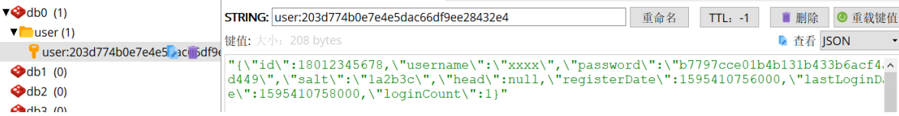


### 4.3 优化登录功能

**UserArgumentResolver.java**

```java
package com.zhyp.seckilldemo.config;

import com.zhyp.seckilldemo.entity.TUser;
import com.zhyp.seckilldemo.service.ITUserService;
import org.springframework.beans.factory.annotation.Autowired;
import org.springframework.core.MethodParameter;
import org.springframework.stereotype.Component;
import org.springframework.web.bind.support.WebDataBinderFactory;
import org.springframework.web.context.request.NativeWebRequest;
import org.springframework.web.method.support.HandlerMethodArgumentResolver;
import org.springframework.web.method.support.ModelAndViewContainer;

/**
 * 自定义用户参数解析器
 */
@Component
public class UserArgumentResolver implements HandlerMethodArgumentResolver {

    @Autowired
    private ITUserService itUserService;

    @Override
    public boolean supportsParameter(MethodParameter parameter) {
        Class<?> parameterType = parameter.getParameterType();
        return parameterType == TUser.class;
    }

    @Override
    public Object resolveArgument(MethodParameter parameter, ModelAndViewContainer mavContainer, NativeWebRequest webRequest, WebDataBinderFactory binderFactory) throws Exception {

        HttpServletRequest nativeRequest = webRequest.getNativeRequest(HttpServletRequest.class);
		 HttpServletResponse nativeResponse = webRequest.getNativeResponse(HttpServletResponse.class);
		String userTicket = CookieUtil.getCookieValue(nativeRequest, "userTicket");
		 if (StringUtils.isEmpty(userTicket)) {
			 return null;
		}
		return itUserService.getUserByCookie(userTicket, nativeRequest, nativeResponse);
    }

}

```

**WebConfig.java** 

```java
package com.zhyp.seckilldemo.config;

import org.springframework.beans.factory.annotation.Autowired;
import org.springframework.context.annotation.Configuration;
import org.springframework.web.method.support.HandlerMethodArgumentResolver;
import org.springframework.web.servlet.config.annotation.EnableWebMvc;
import org.springframework.web.servlet.config.annotation.InterceptorRegistry;
import org.springframework.web.servlet.config.annotation.ResourceHandlerRegistry;
import org.springframework.web.servlet.config.annotation.WebMvcConfigurer;

import java.util.List;

/**
 * MVC配置类
 */
@Configuration
@EnableWebMvc
public class WebConfig implements WebMvcConfigurer {

    @Autowired
    private UserArgumentResolver userArgumentResolver;
    @Autowired
    private AccessLimitInterceptor accessLimitInterceptor;

    @Override
    public void addArgumentResolvers(List<HandlerMethodArgumentResolver> resolvers) {
//        WebMvcConfigurer.super.addArgumentResolvers(resolvers);
        resolvers.add(userArgumentResolver);
    }
}
```

**GoodsController.java**

 ```java
@Controller
@RequestMapping("/goods")
public class GoodsController {
   /**
    * 跳转登录页
    *
    * @return
    */
   @RequestMapping("/toList")
   public String toLogin(Model model,User user) {
      model.addAttribute("user", user);
      return "goodsList";
   }
}
 ```

## 五. 秒杀功能

### 5.1 商品列表页 

用逆向工程生成所需的所有类

数据库插入商品和秒杀商品

#### 5.1.1 GoodsVo 

同时查询商品表和秒杀商品表的返回对象 

```java
package com.zhyp.seckilldemo.vo;

import com.zhyp.seckilldemo.entity.TGoods;
import io.swagger.annotations.ApiModel;
import io.swagger.annotations.ApiModelProperty;

import java.math.BigDecimal;
import java.util.Date;

@Data
@NoArgsConstructor
@AllArgsConstructor
@ApiModel("商品返回对象")
public class GoodsVo extends Goods {

    /**
     * 秒杀价格
     **/
    @ApiModelProperty("秒杀价格")
    private BigDecimal seckillPrice;

    /**
     * 剩余数量
     **/
    @ApiModelProperty("剩余数量")
    private Integer stockCount;

    /**
     * 开始时间
     **/
    @ApiModelProperty("开始时间")
    private Date startDate;

    /**
     * 结束时间
     **/
    @ApiModelProperty("结束时间")
    private Date endDate;
}

```

#### 5.1.2 GoodsMapper 

```java
/**
 * 商品表 Mapper 接口
 */
public interface TGoodsMapper extends BaseMapper<TGoods> {

    /**
     * 返回商品列表
     **/
    List<GoodsVo> findGoodsVo();
}

```

#### 5.1.3 GoodsMapper.xml

```xml
<?xml version="1.0" encoding="UTF-8"?>
<!DOCTYPE mapper PUBLIC "-//mybatis.org//DTD Mapper 3.0//EN" "http://mybatis.org/dtd/mybatis-3-mapper.dtd">
<mapper namespace="com.zhyp.seckilldemo.mapper.TGoodsMapper">

    <!-- 通用查询映射结果 -->
    <resultMap id="BaseResultMap" type="com.zhyp.seckilldemo.entity.TGoods">
        <id column="id" property="id"/>
        <result column="goods_name" property="goodsName"/>
        <result column="goods_title" property="goodsTitle"/>
        <result column="goods_img" property="goodsImg"/>
        <result column="goods_detail" property="goodsDetail"/>
        <result column="goods_price" property="goodsPrice"/>
        <result column="goods_stock" property="goodsStock"/>
    </resultMap>

    <select id="findGoodsVo" resultType="com.zhyp.seckilldemo.vo.GoodsVo">
        SELECT g.id,
               g.goods_name,
               g.goods_title,
               g.goods_img,
               g.goods_price,
               g.goods_stock,
               sg.seckill_price,
               sg.stock_count,
               sg.start_date,
               sg.end_date
        FROM t_goods g
                 LEFT JOIN t_seckill_goods sg on g.id = sg.goods_id
    </select>
</mapper>
```

#### 5.1.4 IGoodsService 

```java
/**
 * 商品表 服务类
 */
public interface ITGoodsService extends IService<TGoods> {

    /**
     * 返回商品列表
     **/
    List<GoodsVo> findGoodsVo();
}

```

#### 5.1.5 GoodsServiceImpl.java

```java
/**
 * 商品表 服务实现类
 *
 * @author LiChao
 * @since 2022-03-03
 */
@Service
public class TGoodsServiceImpl extends ServiceImpl<TGoodsMapper, TGoods> implements ITGoodsService {

    @Autowired
    private TGoodsMapper goodsMapper;

    @Override
    public List<GoodsVo> findGoodsVo() {
        return tGoodsMapper.findGoodsVo();
    }
}

```

#### 5.1.6 GoodsController 

```java
/**
* 商品
*/
@Controller
@RequestMapping("/goods")
public class GoodsController {
   @Autowired
   private IGoodsService goodsService;
   /**
    * 跳转商品列表页
    */
   @RequestMapping("/toList")
   public String toLogin(Model model, User user) {
      model.addAttribute("user", user);
      model.addAttribute("goodsList", goodsService.findGoodsVo());
      return "goodsList";
   }
}
```

#### 5.1.7 goodsList.html

```html
<!DOCTYPE html>
<html lang="en"
      xmlns:th="http://www.thymeleaf.org">
<head>
    <meta charset="UTF-8">
    <title>商品列表</title>
    <!-- jquery -->
    <script type="text/javascript" th:src="@{/js/jquery.min.js}"></script>
    <!-- bootstrap -->
    <link rel="stylesheet" type="text/css" th:href="@{/bootstrap/css/bootstrap.min.css}"/>
    <script type="text/javascript" th:src="@{/bootstrap/js/bootstrap.min.js}"></script>
    <!-- layer -->
    <script type="text/javascript" th:src="@{/layer/layer.js}"></script>
    <!-- common.js -->
    <script type="text/javascript" th:src="@{/js/common.js}"></script>
</head>
<body>
<div class="panel panel-default">
    <div class="panel-heading">秒杀商品列表</div>
    <table class="table" id="goodslist">
        <tr>
            <td>商品名称</td>
            <td>商品图片</td>
            <td>商品原价</td>
            <td>秒杀价</td>
            <td>库存数量</td>
            <td>详情</td>
        </tr>
        <tr th:each="goods,goodsStat : ${goodsList}">
            <td th:text="${goods.goodsName}"></td>
            <td></td>
            <td th:text="${goods.goodsPrice}"></td>
            <td th:text="${goods.seckillPrice}"></td>
            <td th:text="${goods.stockCount}"></td>
            <td><a th:href="'/goodsDetail.html?goodsId='+${goods.id}">详情</a></td>
        </tr>
    </table>
</div>
</body>
</html>
```

#### 5.1.8 测试 

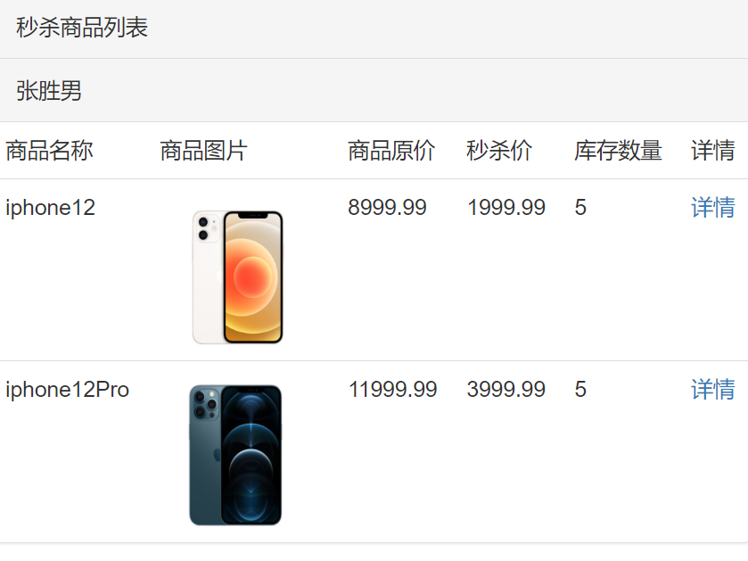

### 5.2 商品详情页

**GoodsMapper.java**

```java
/**
* 根据商品id获取商品详情
* @param goodsId
* @return
*/
GoodsVo findGoodsVoByGoodsId(Long goodsId);
```

**GoodsMapper.xml** 

 ```xml
<select id="findGoodsVobyGoodsId" resultType="com.zhyp.seckilldemo.vo.GoodsVo">
    SELECT g.id,
    g.goods_name,
    g.goods_title,
    g.goods_img,
    g.goods_price,
    g.goods_stock,
    sg.seckill_price,
    sg.stock_count,
    sg.start_date,
    sg.end_date
    FROM t_goods g
    LEFT JOIN t_seckill_goods sg on g.id = sg.goods_id
    WHERE
    g.id=#{goodsId}
</select>
 ```

**GoodsService .java**

 ```java
/**
* 根据商品id获取商品详情
* @param goodsId
* @return
*/
GoodsVo findGoodsVoByGoodsId(Long goodsId);
 ```

**GoodsServiceImpl.java**

```java
/**
* 根据商品id获取商品详情
* @param goodsId
* @return
*/
@Override
public GoodsVo findGoodsVoByGoodsId(Long goodsId) {
   return goodsMapper.findGoodsVoByGoodsId(goodsId);
}
```

**GoodsController** 

```java
@ApiOperation("商品详情")
@RequestMapping(value = "/detail/{goodsId}", 
                method = RequestMethod.GET)
@ResponseBody
public RespBean toDetail(TUser user, @PathVariable Long goodsId) {
    ValueOperations valueOperations = redisTemplate.opsForValue();
    //        String html = (String) valueOperations.get("goodsDetail:" + goodsId);
    //        if (!StringUtils.isEmpty(html)) {
    //            return html;
    //        }

    //        model.addAttribute("user", user);
    GoodsVo goodsVo = itGoodsService.findGoodsVobyGoodsId(goodsId);
    Date startDate = goodsVo.getStartDate();
    Date endDate = goodsVo.getEndDate();
    Date nowDate = new Date();
    //秒杀状态
    int seckillStatus = 0;
    //秒杀倒计时
    int remainSeconds = 0;

    if (nowDate.before(startDate)) {
        //秒杀还未开始0
        remainSeconds = (int) ((startDate.getTime() - nowDate.getTime()) / 1000);
    } else if (nowDate.after(endDate)) {
        //秒杀已经结束
        seckillStatus = 2;
        remainSeconds = -1;
    } else {
        //秒杀进行中
        seckillStatus = 1;
        remainSeconds = 0;
    }
    //        model.addAttribute("remainSeconds", remainSeconds);
    //        model.addAttribute("goods", goodsVo);
    //        model.addAttribute("seckillStatus", seckillStatus);

    //        WebContext webContext = new WebContext(request, response, request.getServletContext(), request.getLocale(), model.asMap());
    //        html = thymeleafViewResolver.getTemplateEngine().process("goodsDetail", webContext);
    //        if (!StringUtils.isEmpty(html)) {
    //            valueOperations.set("goodsDetail:" + goodsId, html, 60, TimeUnit.SECONDS);
    //        }
    DetailVo detailVo = new DetailVo();
    detailVo.setTUser(user);
    detailVo.setGoodsVo(goodsVo);
    detailVo.setRemainSeconds(remainSeconds);
    detailVo.setSecKillStatus(seckillStatus);
    return RespBean.success(detailVo);
}
```

**goodsDetails.html**

```html
<!DOCTYPE html>
<html lang="en"
      xmlns:th="http://www.thymeleaf.org">
<head>
    <meta charset="UTF-8">
    <title>商品详情</title>
    <!-- jquery -->
    <script type="text/javascript" th:src="@{/js/jquery.min.js}"></script>
    <!-- bootstrap -->
    <link rel="stylesheet" type="text/css" th:href="@{/bootstrap/css/bootstrap.min.css}"/>
    <script type="text/javascript" th:src="@{/bootstrap/js/bootstrap.min.js}"></script>
    <!-- layer -->
    <script type="text/javascript" th:src="@{/layer/layer.js}"></script>
    <!-- common.js -->
    <script type="text/javascript" th:src="@{/js/common.js}"></script>
</head>
<body>
<div class="panel panel-default">
    <div class="panel-heading">秒杀商品详情</div>
    <div class="panel-body">
        <span th:if="${user eq null}"> 您还没有登录，请登陆后再操作<br/></span>
        <span>没有收货地址的提示。。。</span>
    </div>
    <table class="table" id="goods">
        <tr>
            <td>商品名称</td>
            <td colspan="3" th:text="${goods.goodsName}"></td>
        </tr>
        <tr>
            <td>商品图片</td>
            <td colspan="3"></td>
        </tr>
        <tr>
            <td>秒杀开始时间</td>
            <td th:text="${#dates.format(goods.startDate,'yyyy-MM-dd HH:mm:ss')}"></td>
            <td id="seckillTip">
                <input type="hidden" id="remainSeconds" th:value="${remainSeconds}">
                <span th:if="${secKillStatus eq 0}">秒杀倒计时: <span id="countDown" th:text="${remainSeconds}"></span>秒
                </span>
                <span th:if="${secKillStatus eq 1}">秒杀进行中</span>
                <span th:if="${secKillStatus eq 2}">秒杀已结束</span>
            </td>
            <td>
                <form id="secKillForm" method="post" action="/seckill/doSeckill">
                    <input type="hidden" name="goodsId" th:value="${goods.id}">
                    <button class="btn btn-primary btn-block" type="submit" id="buyButton">立即秒杀</button>
                </form>
            </td>
        </tr>
        <tr>
            <td>商品原价</td>
            <td colspan="3" th:text="${goods.goodsPrice}"></td>
        </tr>
        <tr>
            <td>秒杀价</td>
            <td colspan="3" th:text="${goods.seckillPrice}"></td>
        </tr>
        <tr>
            <td>库存数量</td>
            <td colspan="3" th:text="${goods.stockCount}"></td>
        </tr>
    </table>
</div>
</body>
<script>
    $(function () {
        countDown();
    });

    function countDown() {
        var remainSeconds = $("#remainSeconds").val();
        var timeout;
        //秒杀还未开始
        if (remainSeconds > 0) {
            $("#buyButton").attr("disabled", true);
            timeout = setTimeout(function () {
                $("#countDown").text(remainSeconds - 1);
                $("#remainSeconds").val(remainSeconds - 1);
                countDown();
            }, 1000);
            // 秒杀进行中
        } else if (remainSeconds == 0) {
            $("#buyButton").attr("disabled", false);
            if (timeout) {
                clearTimeout(timeout);
            }
            $("#seckillTip").html("秒杀进行中")
        } else {
            $("#buyButton").attr("disabled", true);
            $("#seckillTip").html("秒杀已经结束");
        }
    };
</script>
</html>
```

**测试 秒杀倒计时**

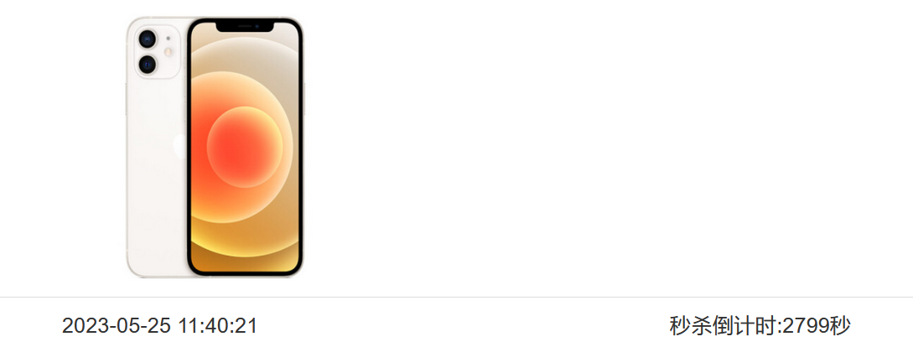

**测试 秒杀进行中**

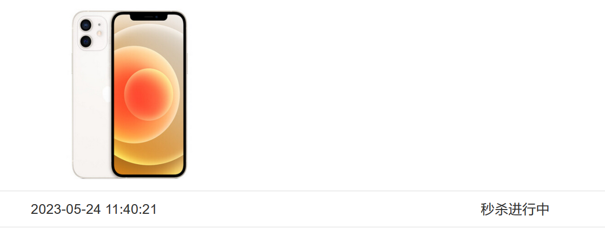

**测试 秒杀已结束**

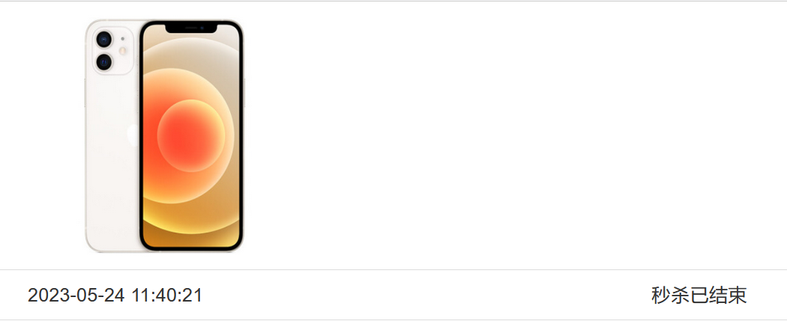

### 5.3 秒杀功能实现

**ITOrderService**

```java
/**
 * 服务类
 *
 * @author LiChao
 * @since 2022-03-03
 */
public interface ITOrderService extends IService<TOrder> {

    /**
     * 秒杀
     *
     * @param user    用户对象
     * @param goodsVo 商品对象
     * @return TOrder
     * @author LC
     * @operation add
     * @date 1:44 下午 2022/3/4
     **/
    TOrder secKill(TUser user, GoodsVo goodsVo);
}
```

**OrderServiceImpl.java** 

 ```java
/**
 * 服务实现类
 *
 * @author LiChao
 * @since 2022-03-03
 */
@Service
@Primary
public class TOrderServiceImpl extends ServiceImpl<TOrderMapper, TOrder> implements ITOrderService {

    @Autowired
    private ITSeckillGoodsService itSeckillGoodsService;
    @Autowired
    private TOrderMapper tOrderMapper;
    @Autowired
    private ITSeckillOrderService itSeckillOrderService;
    @Autowired
    private ITGoodsService itGoodsService;
    @Autowired
    private RedisTemplate redisTemplate;

    @Transactional
    @Override
    public TOrder secKill(TUser user, GoodsVo goodsVo) {
        ValueOperations valueOperations = redisTemplate.opsForValue();

        TSeckillGoods seckillGoods = itSeckillGoodsService.getOne(new QueryWrapper<TSeckillGoods>().eq("goods_id", goodsVo.getId()));
        seckillGoods.setStockCount(seckillGoods.getStockCount() - 1);
//        itSeckillGoodsService.updateById(seckillGoods);
//        boolean seckillGoodsResult = itSeckillGoodsService.update(new UpdateWrapper<TSeckillGoods>()
//                .set("stock_count", seckillGoods.getStockCount())
//                .eq("id", seckillGoods.getId())
//                .gt("stock_count", 0)
//        );
        boolean seckillGoodsResult = itSeckillGoodsService.update(new UpdateWrapper<TSeckillGoods>()
                .setSql("stock_count = " + "stock_count-1")
                .eq("goods_id", goodsVo.getId())
                .gt("stock_count", 0)
        );
//        if (!seckillGoodsResult) {
//            return null;
//        }

        if (seckillGoods.getStockCount() < 1) {
            //判断是否还有库存
            valueOperations.set("isStockEmpty:" + goodsVo.getId(), "0");
            return null;
        }

        //生成订单
        TOrder order = new TOrder();
        order.setUserId(user.getId());
        order.setGoodsId(goodsVo.getId());
        order.setDeliveryAddrId(0L);
        order.setGoodsName(goodsVo.getGoodsName());
        order.setGoodsCount(1);
        order.setGoodsPrice(seckillGoods.getSeckillPrice());
        order.setOrderChannel(1);
        order.setStatus(0);
        order.setCreateDate(new Date());
        tOrderMapper.insert(order);
        //生成秒杀订单
        TSeckillOrder tSeckillOrder = new TSeckillOrder();
        tSeckillOrder.setUserId(user.getId());
        tSeckillOrder.setOrderId(order.getId());
        tSeckillOrder.setGoodsId(goodsVo.getId());
        itSeckillOrderService.save(tSeckillOrder);
        redisTemplate.opsForValue().set("order:" + user.getId() + ":" + goodsVo.getId(), tSeckillOrder);
        return order;
    }
}
 ```

**SeckillController**

```java
/**
* <p>
* 前端控制器
* </p>
*
* @author zhoubin
* @since 1.0.0
*/
@Controller
@RequestMapping("/seckill")
public class SeckillController {
   @Autowired
   private IGoodsService goodsService;
   @Autowired
   private ISeckillOrderService seckillOrderService;
   @Autowired
   private IOrderService orderService;
   @RequestMapping("/doSeckill")
   public String doSeckill(Model model, User user, Long goodsId) {
      if (user == null) {
         return "login";
     }
      model.addAttribute("user", user);
      GoodsVo goods = goodsService.findGoodsVoByGoodsId(goodsId);
      //判断库存
      if (goods.getStockCount() < 1) {
         model.addAttribute("errmsg", RespBeanEnum.EMPTY_STOCK.getMessage());
         return "seckillFail";
     }
      //判断是否重复抢购
      SeckillOrder seckillOrder = seckillOrderService.getOne(new
QueryWrapper<SeckillOrder>().eq("user_id", user.getId()).eq(
            "goods_id",
            goodsId));
      if (seckillOrder != null) {
         model.addAttribute("errmsg", RespBeanEnum.REPEATE_ERROR.getMessage());
         return "seckillFail";
     }
      Order order = orderService.seckill(user, goods);
      model.addAttribute("order",order);
      model.addAttribute("goods",goods);
      return "orderDetail";
   }
}
```

**测试库存不足** 

秒杀成功进入订单详情注意查看库存是否正确扣减，订单是否正确生成 

**测试重复抢购** 

秒杀成功进入订单详情注意查看库存是否正确扣减，订单是否正确生成 

### 5.4 订单详情页

项目重点针对秒杀，所以订单详情只做简单页面展示，随后的支付等功能大家可以自己集成

**OrderDetail.html**

  ```html
<!DOCTYPE HTML>
<html xmlns:th="http://www.thymeleaf.org">
<head>
    <title>订单详情</title>
    <meta http-equiv="Content-Type" content="text/html; charset=UTF-8" />
    <!-- jquery -->
    <script type="text/javascript" th:src="@{/js/jquery.min.js}"></script>
    <!-- bootstrap -->
    <link rel="stylesheet" type="text/css" th:href="@{/bootstrap/css/bootstrap.min.css}" />
    <script type="text/javascript" th:src="@{/bootstrap/js/bootstrap.min.js}"></script>
    <!-- layer -->
    <script type="text/javascript" th:src="@{/layer/layer.js}"></script>
    <!-- common.js -->
    <script type="text/javascript" th:src="@{/js/common.js}"></script>
</head>
<body>
    <div class="panel panel-default">
        <div class="panel-heading">秒杀订单详情</div>
        <table class="table" id="order">
            <tr>
                <td>商品名称</td>
                <td th:text="${goods.goodsName}" colspan="3"></td>
            </tr>
            <tr>
                <td>商品图片</td>
                <td colspan="2"></td>
            </tr>
            <tr>
                <td>订单价格</td>
                <td colspan="2" th:text="${order.goodsPrice}"></td>
            </tr>
            <tr>
                <td>下单时间</td>
                <td th:text="${#dates.format(order.createDate, 'yyyy-MM-dd HH:mm:ss')}" colspan="2"></td>
            </tr>
            <tr>
                <td>订单状态</td>
                <td >
                    <span th:if="${order.status eq 0}">未支付</span>
                    <span th:if="${order.status eq 1}">待发货</span>
                    <span th:if="${order.status eq 2}">已发货</span>
                    <span th:if="${order.status eq 3}">已收货</span>
                    <span th:if="${order.status eq 4}">已退款</span>
                    <span th:if="${order.status eq 5}">已完成</span>
                </td>
                <td>
                    <button class="btn btn-primary btn-block" type="submit" id="payButton">立即支付</button>
                </td>
            </tr>
            <tr>
                <td>收货人</td>
                <td colspan="2">XXX  18012345678</td>
            </tr>
            <tr>
                <td>收货地址</td>
                <td colspan="2">上海市浦东区世纪大道</td>
            </tr>
        </table>
    </div>
</body>
</html>
  ```

**测试:**

至此，简单的秒杀功能逻辑就完成了，下面进入优化阶段

## 六. 系统压测

### 6.1 JMeter 入门

- 安装 

官网：https://jmeter.apache.org/ 

下载地址：https://jmeter.apache.org/download_jmeter.cgi 

下载解压后直接在 bin 目录里双击 jmeter.bat 即可启动（Lunix系统通过 jmeter.sh 启动） 

- 修改中文 

Options-->Choose Language-->Chinese(Simplified)

- 简单使用 

我们先使用JMeter测试一下跳转商品列表页的接口。 

首先创建线程组，步骤：添加--> 线程(用户) --> 线程组

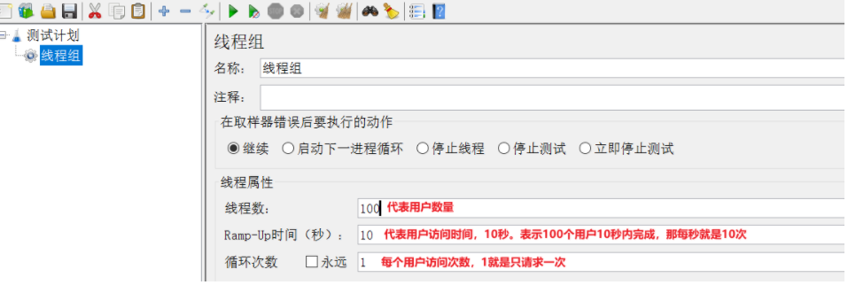

- 创建HTTP请求默认值，

步骤：添加--> 配置元件 --> HTTP请求默认值 

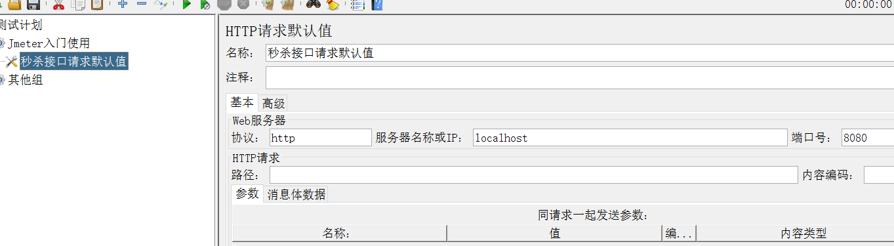

- 添加测试接口

步骤：添加 --> 取样器 --> HTTP请求

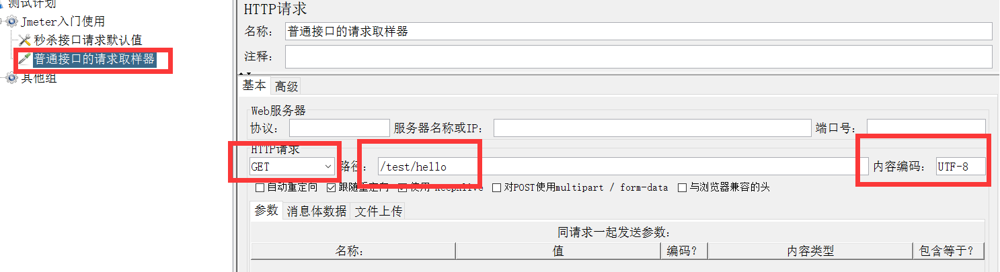

- 查看输出结果

步骤：添加 --> 监听器 --> 聚合报告/图形结果/用表格察看结果

- 启动即可在监听器看到对应的结果

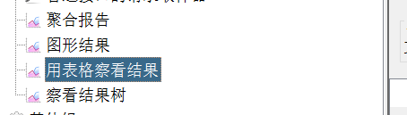

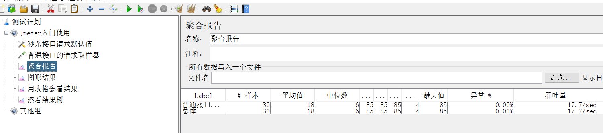

### 6.2 准备测试

**UserController.java** 

```java
@Controller
@RequestMapping("/user")
public class UserController {
   /**
    * 用户信息(测试)
    * @param user
    * @return
    */
   @RequestMapping("/info")
   @ResponseBody
   public RespBean info(User user){
      return RespBean.success(user);
   }
}
```

**配置同一用户测试**

- 添加HTTP请求用户信息

- 查看聚合结果

  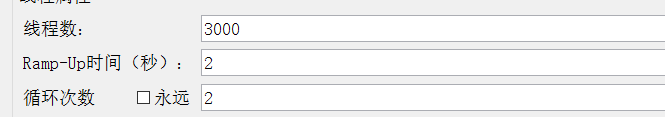

- 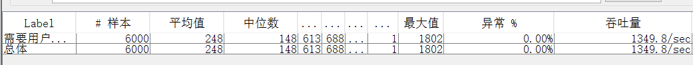

- 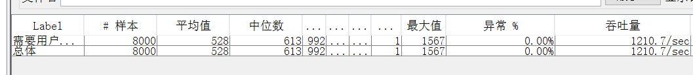

- 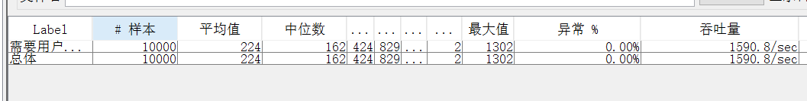

- 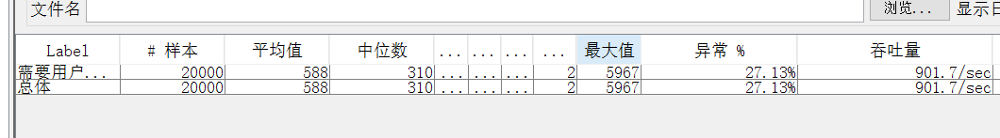

**配置不同用户测试**

- 准备配置文件config.txt

  具体用户和userTicket 

  18012345678,bd055fb14eef4d1ea2933ff8d6e44575 

- 添加 --> 配置元件 --> CSV Data Set Config

  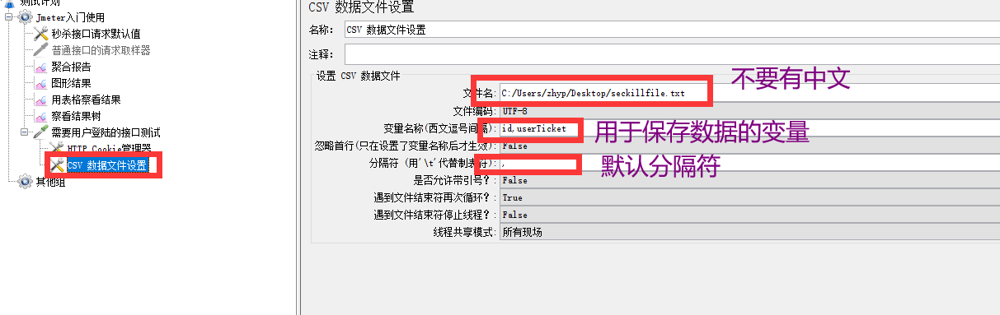

- 添加 --> 配置元件 --> HTTP Cookie管理器 

  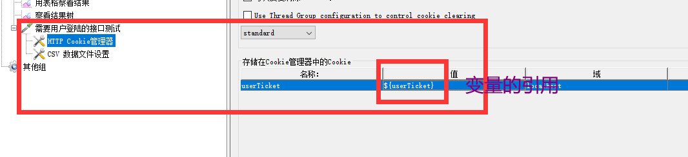

- 修改HTTP请求用户信息

- 查看结果(聚合报告)

  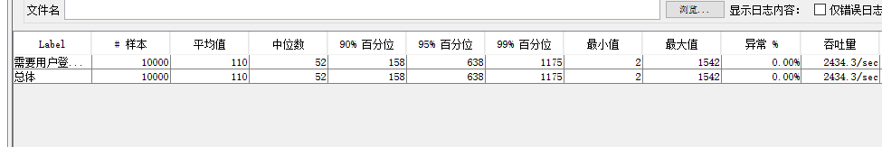

  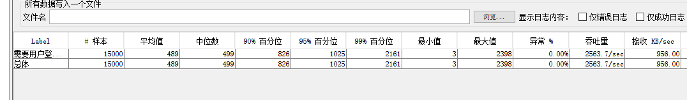

  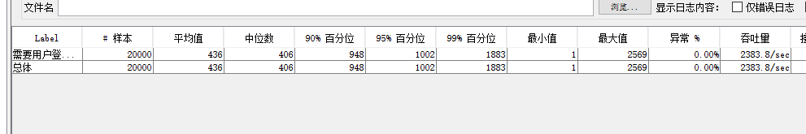

  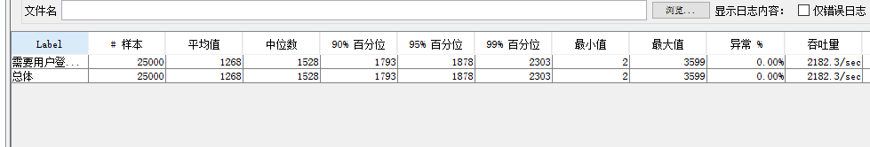

  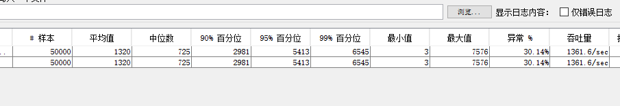

### 6.3 正式压测

#### 6.3.1 压测商品列表接口 

准备1000个线程，循环20次。压测商品列表接口，测试3次，查看结果。 

- 创建线程组

- HTTP请求默认值

- HTTP请求

- 结果(聚合报告)

  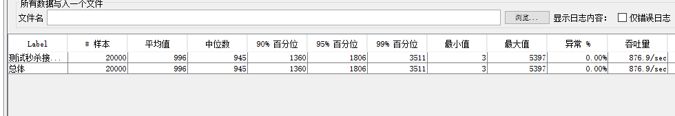

  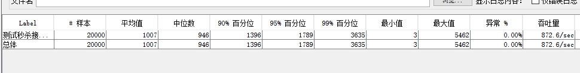

  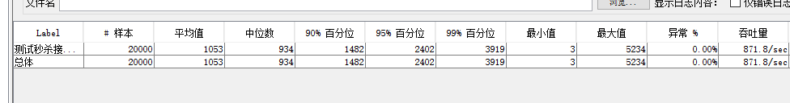

#### 6.3.2 压测秒杀接口

- 创建用户 

使用工具类往数据库插入5000用户，并且调用登录接口获取token，写入config.txt

- UserUtil.java

```java
/**
* 生成用户工具类
*/
public class UserUtil {
   private static void createUser(int count) throws Exception {
      List<User> users = new ArrayList<>(count);
      //生成用户
      for (int i = 0; i < count; i++) {
         User user = new User();
         user.setId(13000000000L + i);
         user.setLoginCount(1);
         user.setUsername("user" + i);
         user.setRegisterDate(new Date());
         user.setSalt("1a2b3c");
         user.setPassword(MD5Util.inputPassToDbPass("123456", user.getSalt()));
         users.add(user);
     }
      System.out.println("create user");
      //插入数据库
      Connection conn = getConn();
      String sql = "insert into t_user(login_count, username, register_date, 
salt, password, id)values(?,?,?,?,?,?)";
      PreparedStatement pstmt = conn.prepareStatement(sql);
      for (int i = 0; i < users.size(); i++) {
         User user = users.get(i);
         pstmt.setInt(1, user.getLoginCount());
         pstmt.setString(2, user.getUsername());
         pstmt.setTimestamp(3, new Timestamp(user.getRegisterDate().getTime()));
         pstmt.setString(4, user.getSalt());
         pstmt.setString(5, user.getPassword());
         pstmt.setLong(6, user.getId());
         pstmt.addBatch();
     }
      pstmt.executeBatch();
      pstmt.close();
      conn.close();
      System.out.println("insert to db");
      //登录，生成token
      String urlString = "http://localhost:8080/login/doLogin";
      File file = new File("C:\\Users\\Administrator\\Desktop\\config.txt");
      if (file.exists()) {
         file.delete();
     }
      RandomAccessFile raf = new RandomAccessFile(file, "rw");
      file.createNewFile();
      raf.seek(0);
      for (int i = 0; i < users.size(); i++) {
         User user = users.get(i);
         URL url = new URL(urlString);
         HttpURLConnection co = (HttpURLConnection) url.openConnection();
         co.setRequestMethod("POST");
         co.setDoOutput(true);
         OutputStream out = co.getOutputStream();
         String params = "mobile=" + user.getId() + "&password=" +
MD5Util.inputPassToFormPass("123456");
         out.write(params.getBytes());
         out.flush();
         InputStream inputStream = co.getInputStream();
         ByteArrayOutputStream bout = new ByteArrayOutputStream();
         byte buff[] = new byte[1024];
         int len = 0;
         while ((len = inputStream.read(buff)) >= 0) {
            bout.write(buff, 0, len);
         }
         inputStream.close();
         bout.close();
         String response = new String(bout.toByteArray());
         ObjectMapper mapper = new ObjectMapper();
         RespBean respBean = mapper.readValue(response, RespBean.class);
         String userTicket = ((String) respBean.getObj());
         System.out.println("create userTicket : " + user.getId());
         String row = user.getId() + "," + userTicket;
         raf.seek(raf.length());
         raf.write(row.getBytes());
         raf.write("\r\n".getBytes());
         System.out.println("write to file : " + user.getId());
     }
      raf.close();
      System.out.println("over");
   }
   private static Connection getConn() throws Exception {
      String url = "jdbc:mysql://localhost:3306/seckill?useUnicode=true&characterEncoding=UTF-8&serverTimezone=Asia/Shanghai";
      String username = "root";
      String password = "root";
      String driver = "com.mysql.cj.jdbc.Driver";
      Class.forName(driver);
      return DriverManager.getConnection(url, username, password);
   }
   public static void main(String[] args) throws Exception {
      createUser(5000);
   }
}
```

- 查看config.txt

#### 6.3.3 配置秒杀接口测试

- 创建线程组

  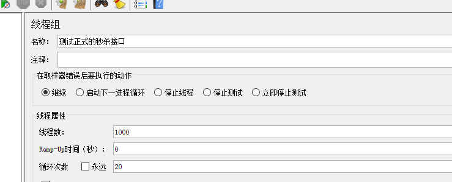

- HTTP请求默认值

  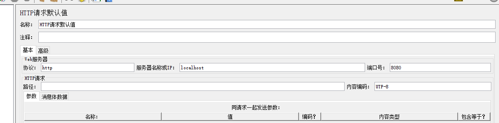

- CVS数据文件设置

  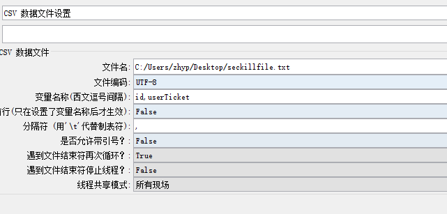

- HTTP Cookie管理器

  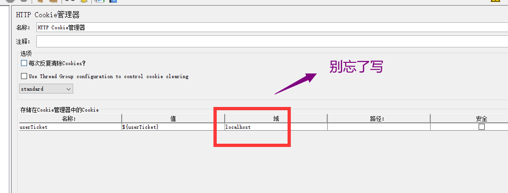

- HTTP请求

  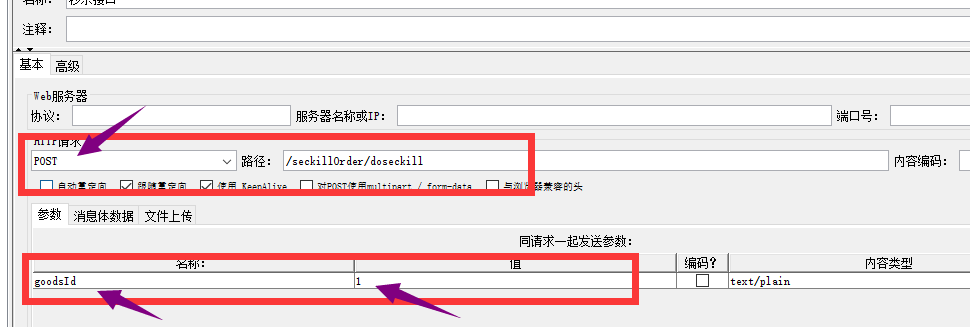

- 查看结果报告

  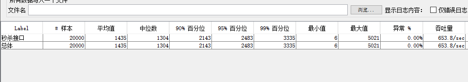

  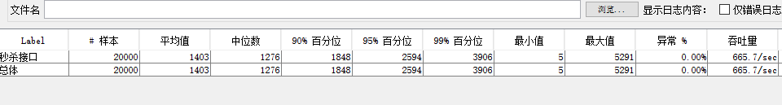

  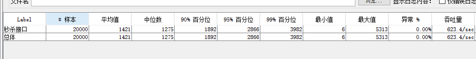

- 查看是否库存超卖的情况

  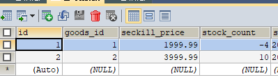

## 七 页面优化

### 7.1 缓存优化

#### 7.1.1 页面缓存

```java
/**
* 商品
*/
@Controller
@RequestMapping("/goods")
public class GoodsController {
    @Autowired
    private IGoodsService goodsService;
    @Autowired
    private RedisTemplate redisTemplate;
    @Autowired
    private ThymeleafViewResolver thymeleafViewResolver;
    /**
     * 跳转商品列表页
     *
     * @return
     */
    @RequestMapping(value = "/toList", produces = "text/html;charset=utf-8")
    @ResponseBody
    public String toLogin(HttpServletRequest request, HttpServletResponse
                          response, Model model, User user) {
        ValueOperations valueOperations = redisTemplate.opsForValue();
        //Redis中获取页面，如果不为空，直接返回页面
        String html = (String) valueOperations.get("goodsList");
        if (!StringUtils.isEmpty(html)) {
            return html;
        }
        model.addAttribute("user", user);
        model.addAttribute("goodsList", goodsService.findGoodsVo());
        // return "goodsList";
        //如果为空，手动渲染，存入Redis并返回
        WebContext context = new WebContext(request, response, 
                                            request.getServletContext(), request.getLocale(),
                                            model.asMap());
        html = thymeleafViewResolver.getTemplateEngine().process("goodsList", 
                                                                 context);
        if (!StringUtils.isEmpty(html)) {
            valueOperations.set("goodsList", html, 60, TimeUnit.SECONDS);
        }
        return html;
    }
    /**
     * 跳转商品详情页
     *
     * @param model
     * @param user
     * @param goodsId
     * @return
     */
    @RequestMapping(value = "/toDetail/{goodsId}", produces =
                    "text/html;charset=utf-8")
    @ResponseBody
    public String toDetail(HttpServletRequest request, HttpServletResponse
                           response, Model model, User user,
                           @PathVariable Long goodsId) {
        ValueOperations valueOperations = redisTemplate.opsForValue();
        //Redis中获取页面，如果不为空，直接返回页面
        String html = (String) valueOperations.get("goodsDetail:" + goodsId);
        if (!StringUtils.isEmpty(html)) {
            return html;
        }
        model.addAttribute("user", user);
        GoodsVo goods = goodsService.findGoodsVoByGoodsId(goodsId);
        model.addAttribute("goods", goods);
        Date startDate = goods.getStartDate();
        Date endDate = goods.getEndDate();
        Date nowDate = new Date();
        //秒杀状态
        int secKillStatus = 0;
        //剩余开始时间
        int remainSeconds = 0;
        //秒杀还未开始
        if (nowDate.before(startDate)) {
            remainSeconds = (int) ((startDate.getTime() - nowDate.getTime()) /
                                   1000);
            // 秒杀已结束
        } else if (nowDate.after(endDate)) {
            secKillStatus = 2;
            remainSeconds = -1;
            // 秒杀中
        } else {
            secKillStatus = 1;
            remainSeconds = 0;
        }
        model.addAttribute("secKillStatus", secKillStatus);
        model.addAttribute("remainSeconds", remainSeconds);
        // return "goodsDetail";
        //如果为空，手动渲染，存入Redis并返回
        WebContext context = new WebContext(request, response, 
                                            request.getServletContext(), request.getLocale(),
                                            model.asMap());
        html = thymeleafViewResolver.getTemplateEngine().process("goodsDetail", 
                                                                 context);
        if (!StringUtils.isEmpty(html)) {
            valueOperations.set("goodsDetail:" + goodsId, html, 60, 
                                TimeUnit.SECONDS);
        }
        return html;
    }
}
```

重新测试，可以发现对比之前QPS提升明显

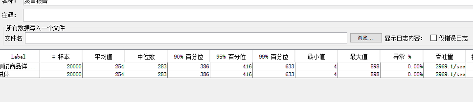

#### 7.1.2 对象缓存

```java
RespBeanEnum.java
	MOBILE_NOT_EXIST(500213, "手机号码不存在"),
	PASSWORD_UPDATE_FAIL(500214, "密码更新失败"),

IUserService.java
    /**
    * 更新密码
    * @param userTicket
    * @param id
    * @param password
    * @return
    */
    RespBean updatePassword(String userTicket,Long id,String password);

UserServiceImpl.java
    /**
    * 更新密码
    */
    @Override
    public RespBean updatePassword(String userTicket, Long id, String password) {
        User user = userMapper.selectById(id);
        if (user == null) {
            throw new GlobalException(RespBeanEnum.MOBILE_NOT_EXIST);
        }
        user.setPassword(MD5Util.inputPassToDbPass(password, user.getSalt()));
        int result = userMapper.updateById(user);
        if (1 == result) {
            //删除Redis
            redisTemplate.delete("user:" + userTicket);
            return RespBean.success();
        }
        return RespBean.error(RespBeanEnum.PASSWORD_UPDATE_FAIL);
    }
```

### 7.2 页面静态化 

#### 7.2.1 商品详情静态化

**DetailVo.java** 

```java
package com.xxxx.seckill.vo;
import com.xxxx.seckill.pojo.User;
import lombok.AllArgsConstructor;
import lombok.Data;
import lombok.NoArgsConstructor;
/**
* @author zhoubin
* @since 1.0.0
*/
@Data
@NoArgsConstructor
@AllArgsConstructor
public class DetailVo {
   private User user;
   private GoodsVo goodsVo;
   private int secKillStatus;
   private int remainSeconds;
}
```

**GoodsController.java** 

 ```java
/**
* 跳转商品详情页
*
* @param model
* @param user
* @param goodsId
* @return
*/
@RequestMapping(value = "/detail/{goodsId}")
@ResponseBody
public RespBean toDetail(HttpServletRequest request, 		
                         HttpServletResponse response, Model model, 
                         User user,@PathVariable Long goodsId) {
   GoodsVo goods = goodsService.findGoodsVoByGoodsId(goodsId);
   Date startDate = goods.getStartDate();
   Date endDate = goods.getEndDate();
   Date nowDate = new Date();
   //秒杀状态
   int secKillStatus = 0;
   //剩余开始时间
   int remainSeconds = 0;
   //秒杀还未开始
   if (nowDate.before(startDate)) {
      remainSeconds = (int) ((startDate.getTime() - nowDate.getTime()) / 1000);
      // 秒杀已结束
   } else if (nowDate.after(endDate)) {
      secKillStatus = 2;
      remainSeconds = -1;
      // 秒杀中
   } else {
      secKillStatus = 1;
      remainSeconds = 0;
   }
   DetailVo detailVo = new DetailVo();
   detailVo.setGoodsVo(goods);
   detailVo.setUser(user);
   detailVo.setRemainSeconds(remainSeconds);
   detailVo.setSecKillStatus(secKillStatus);
   return RespBean.success(detailVo);
}
 ```

**commons.js**

```javascript
// 获取url参数
function g_getQueryString(name) {
   var reg = new RegExp("(^|&)" + name + "=([^&]*)(&|$)");
   var r = window.location.search.substr(1).match(reg);
   if(r != null) return unescape(r[2]);
   return null;
};
//设定时间格式化函数，使用new Date().format("yyyy-MM-dd HH:mm:ss");
Date.prototype.format = function (format) {
   var args = {
      "M+": this.getMonth() + 1,
      "d+": this.getDate(),
      "H+": this.getHours(),
      "m+": this.getMinutes(),
      "s+": this.getSeconds(),
   };
   if (/(y+)/.test(format))
      format = format.replace(RegExp.$1, (this.getFullYear() + "").substr(4 -
RegExp.$1.length));
   for (var i in args) {
      var n = args[i];
      if (new RegExp("(" + i + ")").test(format))
         format = format.replace(RegExp.$1, RegExp.$1.length == 1 ? n : ("00" +
n).substr(("" + n).length));
   }
   return format;
};
```

**goodsDetail.htm** 

 ```html
<!DOCTYPE html>
智者乐水 仁者乐山 程序员 乐字节 91 如果需要更多优质的Java、Python、架构、大数据等IT资料请加微信：lezijie007
<html lang="en">
<head>
    <meta charset="UTF-8">
    <title>商品详情</title>
    <!-- jquery -->
    <script type="text/javascript" src="/js/jquery.min.js"></script>
    <!-- bootstrap -->
    <link rel="stylesheet" type="text/css"
href="/bootstrap/css/bootstrap.min.css"/>
    <script type="text/javascript" src="/bootstrap/js/bootstrap.min.js">
</script>
    <!-- layer -->
    <script type="text/javascript" src="/layer/layer.js"></script>
    <!-- common.js -->
    <script type="text/javascript" src="/js/common.js"></script>
</head>
<body>
<div class="panel panel-default">
    <div class="panel-heading">秒杀商品详情</div>
    <div class="panel-body">
        <span id="userTip"> 您还没有登录，请登陆后再操作<br/></span>
        <span>没有收货地址的提示。。。</span>
    </div>
    <table class="table" id="goods">
        <tr>
            <td>商品名称</td>
            <td colspan="3" id="goodsName"></td>
        </tr>
        <tr>
            <td>商品图片</td>
            <td colspan="3"></td>
        </tr>
        <tr>
            <td>秒杀开始时间</td>
            <td id="startTime"></td>
            <td>
                <input type="hidden" id="remainSeconds"/>
                <!-- <span if="secKillStatus eq 0">秒杀倒计时：<span 
id="countDown"
                                                           text="remainSeconds">
</span>秒</span>
                 <span if="secKillStatus eq 1">秒杀进行中</span>
                 <span if="secKillStatus eq 2">秒杀已结束</span>-->
                <span id="seckillTip"></span>
            </td>
            <td>
                <form id="seckillForm" method="post"
action="/seckill/doSeckill">
                    <button class="btn btn-primary btn-block" type="submit"
id="buyButton">立即秒杀</button>
                    <input type="hidden" name="goodsId" id="goodsId"/>
                </form>
            </td>
        </tr>
        <tr>
            <td>商品原价</td>
            <td colspan="3" id="goodsPrice"></td>
        </tr>
        <tr>
            <td>秒杀价</td>
            <td colspan="3" id="seckillPrice"></td>
        </tr>
        <tr>
            <td>库存数量</td>
            <td colspan="3" id="stockCount"></td>
        </tr>
    </table>
</div>
</body>
<script>
    $(function () {
            // countDown();
            getDetails();
       }
   );
    function getDetails() {
        var goodsId = g_getQueryString("goodsId");
        $.ajax({
            url: "/goods/detail/" + goodsId,
            type: "GET",
            success: function (data) {
                if (data.code == 200) {
                    render(data.obj);
               } else {
                    layer.msg(data.message);
               }
           },
            error: function () {
                layer.msg("客户端请求错误");
           }
       })
   }
    function render(detail) {
        var user = detail.user;
        var goods = detail.goodsVo;
        var remainSeconds = detail.remainSeconds;
        if (user) {
            $("#userTip").hide();
       }
        $("#goodsName").text(goods.goodsName);
        $("#goodsImg").attr("src", goods.goodsImg);
        $("#startTime").text(new Date(goods.startDate).format("yyyy-MM-dd 
HH:mm:ss"));
        $("#remainSeconds").val(remainSeconds);
        $("#goodsId").val(goods.id);
        $("#goodsPrice").text(goods.goodsPrice);
        $("#seckillPrice").text(goods.seckillPrice);
        $("#stockCount").text(goods.stockCount);
        countDown();
   }
    function countDown() {
        var remainSeconds = $("#remainSeconds").val();
        var timeout;
        //秒杀还没开始，倒计时
        if (remainSeconds > 0) {
            $("#buyButton").attr("disabled", true);
            $("#seckillTip").html("秒杀倒计时：" + remainSeconds + "秒");
            timeout = setTimeout(function () {
                    // $("#countDown").text(remainSeconds - 1);
                    $("#remainSeconds").val(remainSeconds - 1);
                    countDown();
               },
                1000
           );
       }
        //秒杀进行中
        else if (remainSeconds == 0) {
            $("#buyButton").attr("disabled", false);
            if (timeout) {
                clearTimeout(timeout);
           }
            $("#seckillTip").html("秒杀进行中");
            //秒杀已经结束
       } else {
            $("#buyButton").attr("disabled", true);
            $("#seckillTip").html("秒杀已经结束");
       }
   }
</script>
</html>
 ```

**测试秒杀未开始,显示剩余时间**


**测试秒杀进行中**

**测试秒杀已结束**

#### 7.2.2 秒杀静态化

**SeckillController.java**

 ```java
/**
* 前端控制器
*/
@Controller
@RequestMapping("/seckill")
public class SeckillController {
   @Autowired
   private IGoodsService goodsService;
   @Autowired
   private ISeckillOrderService seckillOrderService;
   @Autowired
   private IOrderService orderService;
   @RequestMapping(value = "/doSeckill", method = RequestMethod.POST)
   @ResponseBody
   public RespBean doSeckill(User user, Long goodsId) {
      if (user == null) {
         return RespBean.error(RespBeanEnum.SESSION_ERROR);
     }
      GoodsVo goods = goodsService.findGoodsVoByGoodsId(goodsId);
      //判断库存
      if (goods.getStockCount() < 1) {
         return RespBean.error(RespBeanEnum.EMPTY_STOCK);
     }
      //判断是否重复抢购
      SeckillOrder seckillOrder = seckillOrderService.getOne(new
QueryWrapper<SeckillOrder>().eq("user_id",
            user.getId()).eq(
            "goods_id",
            goodsId));
      if (seckillOrder != null) {
         return RespBean.error(RespBeanEnum.REPEATE_ERROR);
     }
      Order order = orderService.seckill(user, goods);
      return RespBean.success(order);
   }
}
 ```

**goodsDetail.html**

```html
<td>
    <!--<form id="seckillForm" method="post" action="/seckill/doSeckill">
        <button class="btn btn-primary btn-block" type="submit" id="buyButton">
立即秒杀</button>
        <input type="hidden" name="goodsId" id="goodsId"/>
    </form>-->
    <button class="btn btn-primary btn-block" type="button" id="buyButton"
onclick="doSeckill()">立即秒杀
    </button>
    <input type="hidden" name="goodsId" id="goodsId"/>
</td>
<script>
     function doSeckill() {
        $.ajax({
            url: "/seckill/doSeckill",
            type: "POST",
            data: {
                goodsId: $("#goodsId").val(),
           },
            success: function (data) {
                if (data.code == 200) {
                    window.location.href = "/orderDetail.htm?orderId=" +
data.obj.id;
               } else {
                    layer.msg(data.message);
               }
           },
            error: function () {
                layer.msg("客户端请求错误");
           }
       })
   }
</script>
```

**orderDetail.html**

```html
<!DOCTYPE HTML>
<html>
<head>
    <title>订单详情</title>
    <meta http-equiv="Content-Type" content="text/html; charset=UTF-8" />
    <!-- jquery -->
    <script type="text/javascript" src="/js/jquery.min.js"></script>
    <!-- bootstrap -->
    <link rel="stylesheet" type="text/css"
href="/bootstrap/css/bootstrap.min.css" />
    <script type="text/javascript" src="/bootstrap/js/bootstrap.min.js">
</script>
    <!-- layer -->
    <script type="text/javascript" src="/layer/layer.js"></script>
    <!-- common.js -->
    <script type="text/javascript" src="/js/common.js"></script>
</head>
<body>
<div class="panel panel-default">
    <div class="panel-heading">秒杀订单详情</div>
    <table class="table" id="order">
        <tr>
            <td>商品名称</td>
            <td id="goodsName" colspan="3"></td>
        </tr>
        <tr>
            <td>商品图片</td>
            <td colspan="2"></td>
        </tr>
        <tr>
            <td>订单价格</td>
            <td colspan="2" id="goodsPrice"></td>
        </tr>
        <tr>
            <td>下单时间</td>
            <td id="createDate" colspan="2"></td>
        </tr>
        <tr>
            <td>订单状态</td>
            <td id="status">
                <!--<span if="order.status eq 0">未支付</span>
                <span if="order.status eq 1">待发货</span>
                <span if="order.status eq 2">已发货</span>
                <span if="order.status eq 3">已收货</span>
                <span if="order.status eq 4">已退款</span>
                <span if="order.status eq 5">已完成</span>-->
            </td>
            <td>
                <button class="btn btn-primary btn-block" type="submit"
id="payButton">立即支付</button>
            </td>
        </tr>
        <tr>
            <td>收货人</td>
            <td colspan="2">XXX 18012345678</td>
        </tr>
        <tr>
            <td>收货地址</td>
            <td colspan="2">上海市浦东区世纪大道</td>
        </tr>
    </table>
</div>
</body>
</html>
```

**applictaion.yml**

```yaml
spring:
  #静态资源处理
 resources:
    #启用默认静态资源处理，默认启用
   add-mappings: true
   cache:
     cachecontrol:
        #缓存响应时间，单位秒
       max-age: 3600
   chain:
      #资源链中启用缓存，默认启用
     cache: true
      #启用资源链，默认禁用
     enabled: true
      #启用压缩资源(gzip,brotli)解析,默认禁用
     compressed: true
      #启用H5应用缓存，默认禁用
     html-application-cache: true
    #静态资源位置
   static-locations: classpath:/static/
```

**测试: 秒杀功能**

#### 7.2.3 订单详情静态化

**OrderController.java**

```java
package com.xxxx.seckill.controller;
import com.xxxx.seckill.pojo.User;
import com.xxxx.seckill.service.IOrderService;
import com.xxxx.seckill.vo.OrderDetailVo;
import com.xxxx.seckill.vo.RespBean;
import com.xxxx.seckill.vo.RespBeanEnum;
import org.springframework.beans.factory.annotation.Autowired;
import org.springframework.stereotype.Controller;
import org.springframework.web.bind.annotation.RequestMapping;
import org.springframework.web.bind.annotation.ResponseBody;
/**
* 前端控制器
*/
@Controller
@RequestMapping("/order")
public class OrderController {
   @Autowired
   private IOrderService orderService;
   /**
    * 订单详情
    * @param user
    * @param orderId
    * @return
    */
   @RequestMapping("/detail")
   @ResponseBody
   public RespBean detail(User user,Long orderId){
      if (null==user){
         return RespBean.error(RespBeanEnum.SESSION_ERROR);
     }
      OrderDetailVo detail = orderService.detail(orderId);
      return RespBean.success(detail);
   }
}
```

**IOrderService.java**

```java
/**
* 订单详情
* @param orderId
* @return
*/
OrderDetailVo detail(Long orderId);
```

**OrderServiceImpl.java**

```java
/**
* 订单详情
* @param orderId
* @return
*/
@Override
public OrderDetailVo detail(Long orderId) {
   if (null==orderId){
      throw new GlobalException(RespBeanEnum.ORDER_NOT_EXIST);
   }
   Order order = orderMapper.selectById(orderId);
   GoodsVo goodsVo = goodsService.findGoodsVoByGoodsId(order.getGoodsId());
   OrderDetailVo detail = new OrderDetailVo();
   detail.setGoodsVo(goodsVo);
   detail.setOrder(order);
   return detail;
}
```

**OrderDetailVo.java** 

 ```java
@Data
@NoArgsConstructor
@AllArgsConstructor
public class OrderDetailVo {
   private Order order;
   private GoodsVo goodsVo;
}
 ```

**orderDetail.html**

```html
<!DOCTYPE HTML>
<html>
<head>
    <title>订单详情</title>
    <meta http-equiv="Content-Type" content="text/html; charset=UTF-8"/>
    <!-- jquery -->
    <script type="text/javascript" src="/js/jquery.min.js"></script>
    <!-- bootstrap -->
    <link rel="stylesheet" type="text/css"
href="/bootstrap/css/bootstrap.min.css"/>
    <script type="text/javascript" src="/bootstrap/js/bootstrap.min.js">
</script>
    <!-- layer -->
    <script type="text/javascript" src="/layer/layer.js"></script>
    <!-- common.js -->
    <script type="text/javascript" src="/js/common.js"></script>
</head>
<body>
<div class="panel panel-default">
    <div class="panel-heading">秒杀订单详情</div>
    <table class="table" id="order">
        <tr>
            <td>商品名称</td>
            <td id="goodsName" colspan="3"></td>
        </tr>
        <tr>
            <td>商品图片</td>
            <td colspan="2"></td>
        </tr>
        <tr>
            <td>订单价格</td>
            <td colspan="2" id="goodsPrice"></td>
        </tr>
        <tr>
            <td>下单时间</td>
            <td id="createDate" colspan="2"></td>
        </tr>
        <tr>
            <td>订单状态</td>
            <td id="status">
                <!--<span if="order.status eq 0">未支付</span>
                <span if="order.status eq 1">待发货</span>
                <span if="order.status eq 2">已发货</span>
                <span if="order.status eq 3">已收货</span>
                <span if="order.status eq 4">已退款</span>
                <span if="order.status eq 5">已完成</span>-->
            </td>
            <td>
                <button class="btn btn-primary btn-block" type="submit"
id="payButton">立即支付</button>
            </td>
        </tr>
        <tr>
            <td>收货人</td>
            <td colspan="2">XXX 18012345678</td>
        </tr>
        <tr>
            <td>收货地址</td>
            <td colspan="2">上海市浦东区世纪大道</td>
        </tr>
    </table>
</div>
<script>
    $(function () {
        getOrderDetail();
   });
    function getOrderDetail() {
        var orderId = g_getQueryString("orderId");
        $.ajax({
            url: "/order/detail",
            type: "GET",
            data: {
                orderId: orderId
           },
            success: function (data) {
                if (data.code == 200) {
                    render(data.obj);
               } else {
                    layer.msg(data.message);
               }
           },
            error: function () {
                layer.msg("客户端请求错误")
           }
       })
   }
    function render(detail) {
        var goods = detail.goodsVo;
        var order = detail.order;
        $("#goodsName").text(goods.goodsName);
        $("#goodsImg").attr("src", goods.goodsImg);
        $("#goodsPrice").text(order.goodsPrice);
        $("#createDate").text(new Date(order.createDate).format("yyyy-MM-dd 
HH:mm:ss"));
        var status = order.status;
        var statusText = ""
        switch (status) {
            case 0:
                statusText = "未支付";
                break;
            case 1:
                statusText = "待发货";
                break;
            case 2:
                statusText = "已发货";
                break;
            case 3:
                statusText = "已收货";
                break;
            case 4:
                statusText = "已退款";
                break;
            case 5:
                statusText = "已完成";
                break;
       }
        $("#status").text(statusText);
   }
</script>
</body>
</html>
```

**测试运行效果**

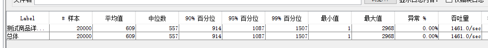

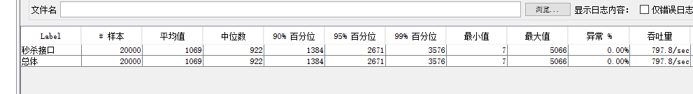

## 八.解决库存超卖

### 8.1 减库存时判断库存是否足够

**OrderServiceImpl.java** 

```java
//秒杀商品表减库存
SeckillGoods seckillGoods = seckillGoodsService.getOne(new
QueryWrapper<SeckillGoods>().eq("goods_id",
      goods.getId()));
seckillGoods.setStockCount(seckillGoods.getStockCount() - 1);
seckillGoodsService.update(new UpdateWrapper<SeckillGoods>().set("stock_count", 
seckillGoods.getStockCount()).eq("id", seckillGoods.getId()).gt("stock_count", 
0));
// seckillGoodsService.updateById(seckillGoods);
```

### 8.2 解决同一用户同时秒杀多件商品。 

**可以通过数据库建立唯一索引避免**

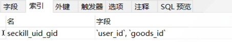

**将秒杀订单信息存入Redis，方便判断是否重复抢购时进行查询**

**OrderServiceImpl.java**

```java
/**
* 秒杀
*/
@Override
@Transactional
public Order seckill(User user, GoodsVo goods) {
   //秒杀商品表减库存
   SeckillGoods seckillGoods = seckillGoodsService.getOne(new
QueryWrapper<SeckillGoods>().eq("goods_id",
         goods.getId()));
   seckillGoods.setStockCount(seckillGoods.getStockCount() - 1);
   boolean seckillGoodsResult = seckillGoodsService.update(new
UpdateWrapper<SeckillGoods>().set("stock_count",         seckillGoods.getStockCount()).eq("id", 
seckillGoods.getId()).gt("stock_count", 0));
   // seckillGoodsService.updateById(seckillGoods);
   if (!(goodsResult&&seckillGoodsResult)){
      return null;
   }
   //生成订单
   Order order = new Order();
   order.setUserId(user.getId());
   order.setGoodsId(goods.getId());
   order.setDeliveryAddrId(0L);
   order.setGoodsName(goods.getGoodsName());
   order.setGoodsCount(1);
   order.setGoodsPrice(seckillGoods.getSeckillPrice());
   order.setOrderChannel(1);
   order.setStatus(0);
   order.setCreateDate(new Date());
   orderMapper.insert(order);
   //生成秒杀订单
   SeckillOrder seckillOrder = new SeckillOrder();
   seckillOrder.setOrderId(order.getId());
   seckillOrder.setUserId(user.getId());
   seckillOrder.setGoodsId(goods.getId());
   seckillOrderService.save(seckillOrder);
   redisTemplate.opsForValue().set("order:" + user.getId() + ":" +
goods.getId(),
         JsonUtil.object2JsonStr(seckillOrder));
   return order;
}
```

**seckillController.java** 

```java
@Controller
@RequestMapping("/seckill")
public class SeckillController {
   @Autowired
   private IGoodsService goodsService;
   @Autowired
   private ISeckillOrderService seckillOrderService;
   @Autowired
   private IOrderService orderService;
   @Autowired
   private RedisTemplate redisTemplate;
   @RequestMapping(value = "/doSeckill", method = RequestMethod.POST)
   @ResponseBody
   public RespBean doSeckill(User user, Long goodsId) {
      if (user == null) {
         return RespBean.error(RespBeanEnum.SESSION_ERROR);
     }
      GoodsVo goods = goodsService.findGoodsVoByGoodsId(goodsId);
      //判断库存
      if (goods.getStockCount() < 1) {
         return RespBean.error(RespBeanEnum.EMPTY_STOCK);
     }
      //判断是否重复抢购
      // SeckillOrder seckillOrder = seckillOrderService.getOne(new 
QueryWrapper<SeckillOrder>().eq("user_id",
      //       user.getId()).eq(
      //       "goods_id",
      //       goodsId));
      String seckillOrderJson = (String) 
redisTemplate.opsForValue().get("order:" + user.getId() + ":" + goodsId);
      if (!StringUtils.isEmpty(seckillOrderJson)) {
         return RespBean.error(RespBeanEnum.REPEATE_ERROR);
     }
      Order order = orderService.seckill(user, goods);
      if (null != order) {
         return RespBean.success(order);
     }
      return RespBean.error(RespBeanEnum.ERROR);
   }
}
```

**SeckillOrder.java**

```java
@Controller
@RequestMapping("/seckill")
public class SeckillController {
   @Autowired
   private IGoodsService goodsService;
   @Autowired
   private ISeckillOrderService seckillOrderService;
   @Autowired
   private IOrderService orderService;
   @Autowired
   private RedisTemplate redisTemplate;
   @RequestMapping(value = "/doSeckill", method = RequestMethod.POST)
   @ResponseBody
   public RespBean doSeckill(User user, Long goodsId) {
      if (user == null) {
         return RespBean.error(RespBeanEnum.SESSION_ERROR);
     }
      GoodsVo goods = goodsService.findGoodsVoByGoodsId(goodsId);
      //判断库存
      if (goods.getStockCount() < 1) {
         return RespBean.error(RespBeanEnum.EMPTY_STOCK);
     }
      //判断是否重复抢购
      // SeckillOrder seckillOrder = seckillOrderService.getOne(new 
QueryWrapper<SeckillOrder>().eq("user_id",
      //       user.getId()).eq(
      //       "goods_id",
      //       goodsId));
      String seckillOrderJson = (String) 
redisTemplate.opsForValue().get("order:" + user.getId() + ":" + goodsId);
      if (!StringUtils.isEmpty(seckillOrderJson)) {
         return RespBean.error(RespBeanEnum.REPEATE_ERROR);
     }
      Order order = orderService.seckill(user, goods);
      return RespBean.success(order);
}
```

**测试** 

- QPS提升并不明显，重点在于是否出现库存超卖现象 

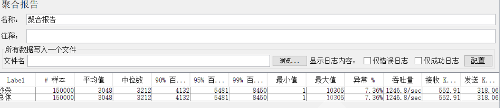

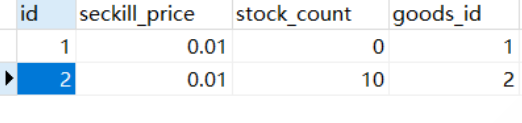

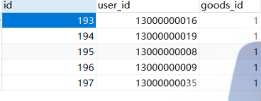

## 九.服务优化

### 9.1 RabbitMQ回顾

```java
1.下载
	https://www.erlang-solutions.com/resources/download.html 
```

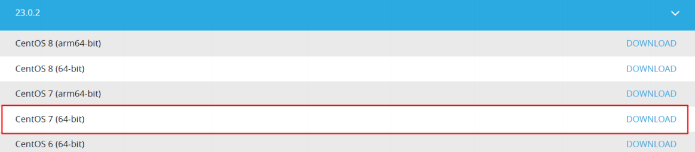

```java
2.安装erlang
	yum -y install esl-erlang_23.0.2-1_centos_7_amd64.rpm
3.下载RabbitMQ
	官网下载地址：http://www.rabbitmq.com/download.html  
4.安装rabbitmq
	yum -y install rabbitmq-server-3.8.5-1.el7.noarch.rpm	
5.安装UI插件
	rabbitmq-plugins enable rabbitmq_management
6.启用rabbitmq服务
	systemctl start rabbitmq-server.service
7.查看状态
	systemctl status rabbitmq-server.service
	
7.1 开启启动
	systemctl enable rabbitmq-server.service
	systemctl disable rabbitmq-server.service
	
8.访问
	guest用户默认只可以localhost(本机)访问
```


```java
9.创建账号 
    rabbitmqctl add_user admin admin 
    设置用户角色 
    rabbitmqctl set_user_tags admin administrator 
    设置用户权限 
    set_permissions [-p <vhostpath>] <user> <conf> <write> <read> 
    rabbitmqctl set_permissions -p "/" admin ".*" ".*" ".*" 
    用户 user_admin 具有/vhost1 这个 virtual host 
    	中所有资源的配置、写、读权限 
    当前用户和角色 
    rabbitmqctl list_users 
    
10.创建其他方式
    方法1:编辑配置文件:/etc/rabbitmq/rabbitmq.config，添加以下内容：
    	[{rabbit, [{loopback_users, []}]}].
    	保存后重启rabbitmq-server。

    方法2: 在本地登录，用http://localhost:15672
    方法3：创建新用户
        rabbitmqctl add_user guest guest
        rabbitmqctl set_user_tags guest administrator
        rabbitmqctl set_permissions -p / guest  ".*" ".*" ".*"
```

### 9.2 SpringBoot整合RabbitMQ

**依赖**

```xml
<!-- AMQP依赖 -->
<dependency>
	<groupId>org.springframework.boot</groupId>
	<artifactId>spring-boot-starter-amqp</artifactId>
</dependency>
```

**配置application.yml**

```yaml
spring:
  #RabbitMQ
 rabbitmq:
    #服务器地址
   host: 192.168.10.100
    #用户名
   username: admin
    #密码
   password: admin
    #虚拟主机
   virtual-host: /
    #端口
   port: 5672
   listener:
     simple:
        #消费者最小数量
       concurrency: 10
        #消费者最大数量
       max-concurrency: 10
        #限制消费者每次只处理一条消息，处理完再继续下一条消息
       prefetch: 1
        #启动时是否默认启动容器，默认true
       auto-startup: true
        #被拒绝时重新进入队列
       default-requeue-rejected: true
   template:
     retry:
        #发布重试，默认false
       enabled: true
        #重试时间 默认1000ms
       initial-interval: 1000
        #重试最大次数，默认3次
       max-attempts: 3
        #重试最大间隔时间，默认10000ms
       max-interval: 10000
        #重试间隔的乘数。比如配2.0 第一次等10s，第二次等20s，第三次等40s
       multiplier: 1.0
```

**RabbitMQConfig.java** 

 ```java
@Configuration
public class RabbitMQConfig {
   @Bean
   public Queue queue(){
      return new Queue("queue",true);
   }
}
 ```

**MQSender.java**

```java
@Service
@Slf4j
public class MQSender {
   @Autowired
   private RabbitTemplate rabbitTemplate;
   public void send(Object msg) {
      log.info("发送消息："+msg);
      rabbitTemplate.convertAndSend("queue", msg);
   }
}
```

**MQReceiver.java**

```java
@Service
@Slf4j
public class MQReceiver {
   @RabbitListener(queues = "queue")
   public void receive(Object msg) {
      log.info("接受消息：" + msg);
   }
}
```

**UserController.java**

```java
/**
* 测试发送RabbitMQ消息
*/
@RequestMapping("/mq")
@ResponseBody
public void mq() {
   mqSender.send("Hello");
}
```

**发送测试**

### 9.3 RabbitMQ交换机[回顾]

```java

```

### 9.4 接口优化 

#### 9.4.1 **思路：减少数据库访问** 

```java
1. 系统初始化，把商品库存数量加载到Redis 
2. 收到请求，Redis预减库存。库存不足，直接返回。否则进入第3步 
3. 请求入队，立即返回排队中 --> 返回给浏览器
4. 请求出队，生成订单，减少库存 
5. 客户端轮询，是否秒杀成功
```

#### 9.4.2 Redis操作库存 

```java
@Controller
@RequestMapping("/seckill")
public class SeckillController implements InitializingBean {
    @Autowired
    private IGoodsService goodsService;
    @Autowired
    private ISeckillOrderService seckillOrderService;
    @Autowired
    private IOrderService orderService;
    @Autowired
    private RedisTemplate redisTemplate;
    @Autowired
    private MQSender mqSender;
    private Map<Long, Boolean> EmptyStockMap = new HashMap<>();
    @RequestMapping(value = "/doSeckill", method = RequestMethod.POST)
    @ResponseBody
    public RespBean doSeckill(User user, Long goodsId) {
        if (user == null) {
            return RespBean.error(RespBeanEnum.SESSION_ERROR);
        }
        /*GoodsVo goods = goodsService.findGoodsVoByGoodsId(goodsId);
     //判断库存
     if (goods.getStockCount() < 1) {
     return RespBean.error(RespBeanEnum.EMPTY_STOCK);
     }
     //判断是否重复抢购
     // SeckillOrder seckillOrder = seckillOrderService.getOne(new 
    QueryWrapper<SeckillOrder>().eq("user_id",
     // user.getId()).eq(
     // "goods_id",
     // goodsId));
     String seckillOrderJson = (String) 
    redisTemplate.opsForValue().get("order:" + user.getId() + ":" + goodsId);
     if (!StringUtils.isEmpty(seckillOrderJson)) {
     return RespBean.error(RespBeanEnum.REPEATE_ERROR);
     }
     Order order = orderService.seckill(user, goods);
     if (null != order) {
     return RespBean.success(order);
     }*/
        ValueOperations valueOperations = redisTemplate.opsForValue();
        //判断是否重复抢购
        String seckillOrderJson = (String) valueOperations.get("order:" +
                                                               user.getId() + ":" + goodsId);
        if (!StringUtils.isEmpty(seckillOrderJson)) {
            return RespBean.error(RespBeanEnum.REPEATE_ERROR);
        }
        //内存标记,减少Redis访问
        if (EmptyStockMap.get(goodsId)) {
            return RespBean.error(RespBeanEnum.EMPTY_STOCK);
        }
        //预减库存
        Long stock = valueOperations.decrement("seckillGoods:" + goodsId);
        if (stock < 0) {
            EmptyStockMap.put(goodsId,true);
            valueOperations.increment("seckillGoods:" + goodsId);
            return RespBean.error(RespBeanEnum.EMPTY_STOCK);
        }
        // 请求入队，立即返回排队中
        SeckillMessage message = new SeckillMessage(user, goodsId);
        mqSender.sendsecKillMessage(JsonUtil.object2JsonStr(message));
        return RespBean.success(0);
    }

	/*
	 * 系统初始化，把商品库存数量加载到Redis
     *
     * @throws Exception
     */
    @Override
    public void afterPropertiesSet() throws Exception {
        List<GoodsVo> list = goodsService.findGoodsVo();
        if (CollectionUtils.isEmpty(list)) {
            return;
        }
        list.forEach(goodsVo -> {
            redisTemplate.opsForValue().set("seckillGoods:" + goodsVo.getId(), 
                                            goodsVo.getStockCount());
            EmptyStockMap.put(goodsVo.getId(), false);
        });
    }
}
```

#### 9.4.3 RabbitMQ秒杀 

**SeckillMessage.java**

```java
/**
* @author zhoubin
* @since 1.0.0
*/
@Data
@NoArgsConstructor
@AllArgsConstructor
public class SeckillMessage {
   private User user;
   private Long goodsId;
}
```

**RabbitMQConfig.java** 

```java
@Configuration
public class RabbitMQConfig {
   private static final String QUEUE = "seckillQueue";
   private static final String EXCHANGE = "seckillExchange";
   @Bean
   public Queue queue(){
      return new Queue(QUEUE);
   }
   @Bean
   public TopicExchange topicExchange(){
      return new TopicExchange(EXCHANGE);
   }
   @Bean
   public Binding binding01(){
      return BindingBuilder.bind(queue()).to(topicExchange()).with("seckill.#");
   }
}
```

**MQSender.java**

```java
@Service
@Slf4j
public class MQSender {
   @Autowired
   private RabbitTemplate rabbitTemplate;
   public void sendsecKillMessage(String message) {
      log.info("发送消息：" + message);
      rabbitTemplate.convertAndSend("seckillExchange", "seckill.msg", message);
   }
}
```

**MQReceiver.java**

```java
@Service
@Slf4j
public class MQReceiver {
   @Autowired
   private IGoodsService goodsService;
   @Autowired
   private RedisTemplate redisTemplate;
   @Autowired
   private IOrderService orderService;
   @RabbitListener(queues = "seckillQueue")
   public void receive(String msg) {
      log.info("QUEUE接受消息：" + msg);
      SeckillMessage message = JsonUtil.jsonStr2Object(msg, 
SeckillMessage.class);
      Long goodsId = message.getGoodsId();
      User user = message.getUser();
      GoodsVo goods = goodsService.findGoodsVoByGoodsId(goodsId);
      //判断库存
      if (goods.getStockCount() < 1) {
         return;
     }
      //判断是否重复抢购
      // SeckillOrder seckillOrder = seckillOrderService.getOne(new 
QueryWrapper<SeckillOrder>().eq("user_id",
      //       user.getId()).eq(
      //       "goods_id",
      //       goodsId));
      String seckillOrderJson = (String) 
redisTemplate.opsForValue().get("order:" + user.getId() + ":" + goodsId);
      if (!StringUtils.isEmpty(seckillOrderJson)) {
         return;
     }
      orderService.seckill(user, goods);
   }
}
```

#### 9.4.4 客户端轮询秒杀结果

**SeckillController.java** 

**ISeckillOrderService.java**

**SeckillOrderServiceImpl.java**

**OrderServiceImpl.java** 

**goodsDetail.html**

**测试**

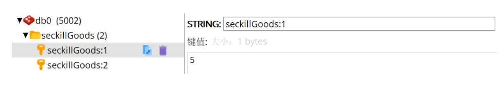

**秒杀成功，数据库及Redis库存数量正确**

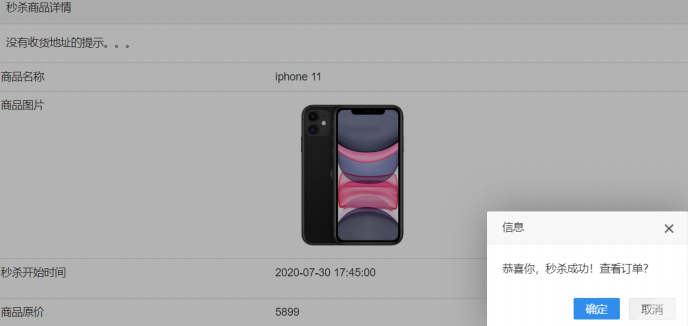

#### 9.4.5 压测秒杀

**QPS相比之前有一定提升**

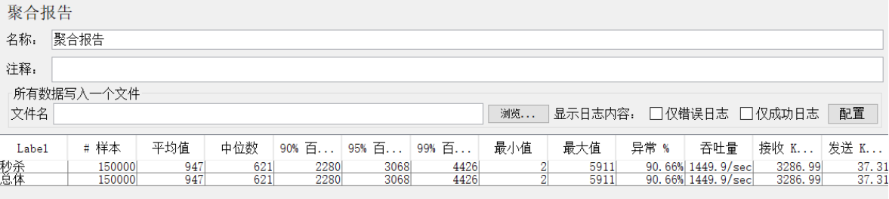

**数据库以及Redis库存数量和订单都正确** 

### 9.5 优化Redis操作库存

上面代码实际演示会发现Redis的库存有问题，原因在于Redis没有做到原子性。我们采用锁去解决 

#### 9.5.1 分布式锁

进来一个线程先占位，当别的线程进来操作时，发现已经有人占位了，就会放弃或者稍后再试 线程操作执行完成后，需要调用del指令释放位子 

```java
@SpringBootTest
class SeckillApplicationTests {
    @Autowired
    private RedisTemplate redisTemplate;
    @Test
    public void testLock01(){
        ValueOperations valueOperations = redisTemplate.opsForValue();
        Boolean isLock = valueOperations.setIfAbsent("k1", "v1");
        if (isLock){
            valueOperations.set("name","xxxx");
            String name = (String) valueOperations.get("name");
            System.out.println(name);
            redisTemplate.delete("k1");
        }else {
            System.out.println("有线程在使用，请稍后");
        }
    }
}
```

- 为了防止业务执行过程中抛异常或者挂机导致del指定没法调用形成死锁，可以添加超时时间

```java
@Test
public void testLock02(){
   ValueOperations valueOperations = redisTemplate.opsForValue();
   Boolean isLock = valueOperations.setIfAbsent("k1","v1",5, TimeUnit.SECONDS);
   if (isLock){
      valueOperations.set("name","xxxx");
      String name = (String) valueOperations.get("name");
      System.out.println(name);
      redisTemplate.delete("k1");
   }else {
      System.out.println("有线程在使用，请稍后");
   }
}
```

- 上面例子，如果业务非常耗时会紊乱。举例：第一个线程首先获得锁，然后执行业务代码，但是业务代 码耗时8秒，这样会在第一个线程的任务还未执行成功锁就会被释放，这时第二个线程会获取到锁开始 执行，在第二个线程开执行了3秒，第一个线程也执行完了，此时第一个线程会释放锁，但是注意，他释放的第二个现成的锁，释放之后，第三个线程进来。 

#### **9.5.2 解决方案：** 

- 尽量避免在获取锁之后，执行耗时操作将锁的value设置为一个随机字符串，每次释放锁的时候，都去比较随机字符串是否一致，如果一 致，再去释放，否则不释放。
- 释放锁时要去查看所得value，比较value是否正确，释放锁总共三个步骤，这三个步骤不具备原子性。 

#### 9.5.3 Lua脚本 

**Lua脚本优势：** 

使用方便，Redis内置了对Lua脚本的支持 ,Lua脚本可以在Rdis服务端原子的执行多个Redis命令,由于网络在很大程度上会影响到Redis性能，使用Lua脚本可以让多个命令一次执行，可以有 效解决网络给Redis带来的性能问题 

**使用Lua脚本思路：** 

提前在Redis服务端写好Lua脚本，然后在java客户端去调用脚本 .可以在java客户端写Lua脚本，写好之后，去执行。需要执行时，每次将脚本发送到Redis上 去执行 

**创建Lua脚本(放在resources目录下)**

**lock.lua**

```lua
if redis.call("get",KEYS[1]) == ARGV[1] then
    return redis.call("del",KEYS[1])
else
    return 0
end
```

**调用脚本** RedisConfig.java

```java
@Bean
public DefaultRedisScript<Boolean> script() {
    DefaultRedisScript<Boolean> redisScript = new DefaultRedisScript<>();
    //放在和application.yml 同层目录下
    redisScript.setLocation(new ClassPathResource("lock.lua"));
    redisScript.setResultType(Boolean.class);
    return redisScript;
}
```

**Test.java**

```java
@Test
public void testLock03(){
    ValueOperations valueOperations = redisTemplate.opsForValue();
    String value = UUID.randomUUID().toString();
    //给锁添加一个过期时间，防止应用在运行过程中抛出异常导致锁无法及时得到释放
    Boolean isLock = valueOperations.setIfAbsent("k1",value,5, TimeUnit.SECONDS);
    //没人占位
    if (isLock){
        valueOperations.set("name","xxxx");
        String name = (String) valueOperations.get("name");
        System.out.println(name);
        System.out.println(valueOperations.get("k1"));
        //释放锁
        Boolean result = (Boolean) redisTemplate.execute(script, 
                                                         Collections.singletonList("k1"), value);
        System.out.println(result);
    }else {
        //有人占位，停止/暂缓 操作
        System.out.println("有线程在使用，请稍后");
    }
}
```

**优化Redis预减库存 stock.lua** 

```java
if (redis.call('exists', KEYS[1]) == 1) then
   local stock = tonumber(redis.call('get', KEYS[1]));
   if (stock > 0) then
      redis.call('incrby', KEYS[1], -1);
      return stock;
   end;
    return 0;
end;
```

**RedisConfig.java**

```java
@Bean
public DefaultRedisScript<Long> script() {
   DefaultRedisScript<Long> redisScript = new DefaultRedisScript<>();
   //放在和application.yml 同层目录下
   redisScript.setLocation(new ClassPathResource("stock.lua"));
   redisScript.setResultType(Long.class);
   return redisScript;
}
```

**SeckillController.java**

```java
@RequestMapping(value = "/doSeckill", method = RequestMethod.POST)
@ResponseBody
public RespBean doSeckill(User user, Long goodsId) {
    if (user == null) {
        return RespBean.error(RespBeanEnum.SESSION_ERROR);
    }
    ValueOperations valueOperations = redisTemplate.opsForValue();
    //判断是否重复抢购
    String seckillOrderJson = (String) valueOperations.get("order:" +
                                                           user.getId() + ":" + goodsId);
    if (!StringUtils.isEmpty(seckillOrderJson)) {
        return RespBean.error(RespBeanEnum.REPEATE_ERROR);
    }
    //内存标记,减少Redis访问
    if (EmptyStockMap.get(goodsId)) {
        return RespBean.error(RespBeanEnum.EMPTY_STOCK);
    }
    //预减库存
    Long stock = (Long) redisTemplate.execute(script, 
                                              Collections.singletonList("seckillGoods:" + goodsId), Collections.EMPTY_LIST);
    if (stock < 0) {
        EmptyStockMap.put(goodsId,true);
        return RespBean.error(RespBeanEnum.EMPTY_STOCK);
    }
    // 请求入队，立即返回排队中
    SeckillMessage message = new SeckillMessage(user, goodsId);
    mqSender.sendsecKillMessage(JsonUtil.object2JsonStr(message));
    return RespBean.success(0);
}
```

## 十 安全优化

### 10.1 秒杀接口地址隐藏

秒杀开始之前，先去请求接口获取秒杀地址

SeckillController.java

```java
@RequestMapping(value = "/path", method = RequestMethod.GET)
@ResponseBody
public RespBean getPath(User user, Long goodsId) {
	if (user == null) {
		return RespBean.error(RespBeanEnum.SESSION_ERROR);
	}
	String str = orderService.createPath(user,goodsId);
	return RespBean.success(str);
}
```

OrderServiceImpl.java

```java
@Override
public boolean checkPath(User user, Long goodsId, String path) {
	if (user==null|| StringUtils.isEmpty(path)){
		return false;
	}
	String redisPath = (String) 				
        redisTemplate.opsForValue().get("seckillPath:" +
		user.getId() + ":" + goodsId);
	return path.equals(redisPath);
}


@Override
public String createPath(User user, Long goodsId) {
	String str = MD5Util.md5(UUIDUtil.uuid() + "123456");
	redisTemplate.opsForValue().set("seckillPath:" + 
          user.getId() + ":" + goodsId, str, 60, TimeUnit.SECONDS);
	return str;
}
```

goodsDetail.htm

```javascript
function getSeckillPath() {
    var goodsId = $("#goodsId").val();
    g_showLoading();
    $.ajax({
        url: "/seckill/path",
        type: "GET",
        data: {
            goodsId: goodsId,
        },
        success: function (data) {
            if (data.code == 200) {
                var path = data.obj;
                doSeckill(path);
            } else {
                layer.msg(data.message);
            }
        },
        error: function () {
            layer.msg("客户端请求错误");
        }
    })
}
function doSeckill(path) {
    $.ajax({
        url: "/seckill/" + path + "/doSeckill",
        type: "POST",
        data: {
            goodsId: $("#goodsId").val(),
        },
        success: function (data) {
            if (data.code == 200) {
            // window.location.href = "/orderDetail.htm?orderId=" +
            data.obj.id;
            getResult($("#goodsId").val());
            } else {
                layer.msg(data.message);
            }
        },
        error: function () {
            layer.msg("客户端请求错误");
        }
    })
}
```


### 10.2 图形验证码

点击秒杀开始前，先输入验证码，分散用户的请求

**依赖**

```xml
<dependency>
<groupId>com.github.whvcse</groupId>
<artifactId>easy-captcha</artifactId>
<version>1.6.2</version>
</dependency>
```

SeckillController.java 

```java
@RequestMapping(value = "/captcha", method = RequestMethod.GET)
public void verifyCode(User user, Long goodsId, HttpServletResponse response) {
    if (null==user||goodsId<0){
    	throw new GlobalException(RespBeanEnum.REQUEST_ILLEGAL);
    }
    // 设置请求头为输出图片类型
    response.setContentType("image/jpg");
    response.setHeader("Pragma", "No-cache");
    response.setHeader("Cache-Control", "no-cache");
    response.setDateHeader("Expires", 0);
    //生成验证码，将结果放入redis
    ArithmeticCaptcha captcha = new ArithmeticCaptcha(130, 32, 3);
    redisTemplate.opsForValue().set("captcha:"+user.getId()+":"+goodsId,captcha.text(),300, TimeUnit.SECONDS);
    try {
    	captcha.out(response.getOutputStream());
    } catch (IOException e) {
    	log.error("验证码生成失败",e.getMessage());
    }
}
```


goodsDetail.htm

```java
<div class="row">
    <div class="form-inline">
        
        <input id="captcha" class="form-control" style="display: none"/>
        <button class="btn btn-primary" type="button" id="buyButton"
        onclick="getSeckillPath()">立即秒杀
        </button>
    </div>
</div>

<script>
function refreshCaptcha() {
	$("#captchaImg").attr("src", "/seckill/captcha?goodsId=" +
	$("#goodsId").val() + "&time=" + new Date())
}
</script>
```


**测试**

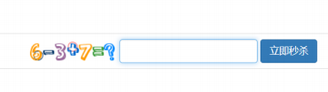

SeckillController.java

```java
@RequestMapping(value = "/path", method = RequestMethod.GET)
@ResponseBody
public RespBean getPath(User user, Long goodsId,String captcha) {
    if (user == null) {
    	return RespBean.error(RespBeanEnum.SESSION_ERROR);
    }
    boolean check = orderService.checkCaptcha(user, goodsId, captcha);
    if (!check){
    	return RespBean.error(RespBeanEnum.ERROR_CAPTCHA);
    }
    String str = orderService.createPath(user, goodsId);
    return RespBean.success(str);
}
```

IOrderService.java

```java
boolean checkCaptcha(User user, Long goodsId, String captcha);
```

OrderServiceImpl.java

```java
@Override
public boolean checkCaptcha(User user, Long goodsId, String captcha) {
    if (StringUtils.isEmpty(captcha)||null==user||goodsId<0){
        return false;
    }
    String redisCaptcha = (String) redisTemplate.opsForValue().get("captcha:" +
    user.getId() + ":" + goodsId);
    return redisCaptcha.equals(captcha);
}

```


goodsDetail.html

```javascript
function getSeckillPath() {
    var goodsId = $("#goodsId").val();
    var captcha = $("#captcha").val();
    g_showLoading();
    $.ajax({
        url: "/seckill/path",
        type: "GET",
        data: {
        	goodsId: goodsId,
        	captcha: captcha
        },
        success: function (data) {
            if (data.code == 200) {
            	var path = data.obj;
            	doSeckill(path);
            } else {
            	layer.msg(data.message);
            }
        },
        error: function () {
        	layer.msg("客户端请求错误");
        }
    })
)
```


**测试** 

- 输入错误验证码，提示错误并且无法秒杀

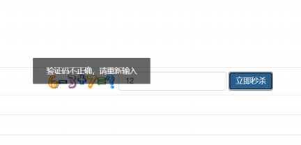

### 10.3 接口限流

#### 10.3.1 简单接口限流

```java
@RequestMapping(value = "/path", method = RequestMethod.GET)
@ResponseBody
public RespBean getPath(User user, Long goodsId, String captcha,
HttpServletRequest request) {
    if (user == null) {
    	return RespBean.error(RespBeanEnum.SESSION_ERROR);
    }
    ValueOperations valueOperations = redisTemplate.opsForValue();
    //限制访问次数，5秒内访问5次
    String uri = request.getRequestURI();
    //方便测试
    captcha = "0";
    Integer count = (Integer) valueOperations.get(uri + ":" + user.getId());
    if (count==null){
    	valueOperations.set(uri + ":" + user.getId(),1,5,TimeUnit.SECONDS);
    }else if (count<5){
    	valueOperations.increment(uri + ":" + user.getId());
    }else {
    	return RespBean.error(RespBeanEnum.ACCESS_LIMIT_REACHED);
    }
    boolean check = orderService.checkCaptcha(user, goodsId, captcha);
    if (!check){
    	return RespBean.error(RespBeanEnum.ERROR_CAPTCHA);
    }
    String str = orderService.createPath(user, goodsId);
    return RespBean.success(str);
}
```


#### 10.3.2 通用接口限流

UserContext.java

```java
public class UserContext {
    private static ThreadLocal<User> userHolder = new ThreadLocal<>();
    public static void setUser(User user) {
    	userHolder.set(user);
    }
    public static User getUser() {
    	return userHolder.get();
    }
}
```

UserArgumenResover.java

```java
@Override
public Object resolveArgument(MethodParameter parameter, ModelAndViewContainer
mavContainer,
NativeWebRequest webRequest, WebDataBinderFactory
binderFactory) throws Exception {
	return UserContext.getUser();
}
```

AccessInterceptor.java

```java
@Component
public class AccessInterceptor implements HandlerInterceptor {
    @Autowired
    private IUserService userService;
    @Autowired
    private RedisTemplate redisTemplate;
    @Override
    public boolean preHandle(HttpServletRequest request, HttpServletResponse
    response, Object handler) throws Exception {
        if (handler instanceof HandlerMethod){
            User user = getUser(request,response);
            UserContext.setUser(user);
            HandlerMethod hm = (HandlerMethod) handler;
            AccessLimit accessLimit = hm.getMethodAnnotation(AccessLimit.class);
            if (accessLimit==null){
                return true;
            }
            int second = accessLimit.second();
            int maxCount = accessLimit.maxCount();
            boolean needLogin = accessLimit.needLogin();
            String key = request.getRequestURI();
            if (needLogin){
                if (user==null){
                    render(response,RespBeanEnum.SESSION_ERROR);
                    return false;
                }
        	key += ":"+user.getId();
        }
        ValueOperations valueOperations = redisTemplate.opsForValue();
        Integer count = (Integer) valueOperations.get(key);
        if (count == null) {
        	valueOperations.set(key, 1, second, TimeUnit.SECONDS);
        } else if (count < maxCount) {
        	valueOperations.increment(key);
        } else {
        	render(response,RespBeanEnum.ACCESS_LIMIT_REACHED);
        	return false;
        }
        }
        return true;
    }
    private void render(HttpServletResponse response, RespBeanEnum respBeanEnum)
    throws IOException {
        response.setCharacterEncoding("UTF-8");
        response.setContentType("application/json");
        PrintWriter out = response.getWriter();
        RespBean bean = RespBean.error(respBeanEnum);
        out.write(new ObjectMapper().writeValueAsString(bean));
        out.flush();
        out.close();
    }
    private User getUser(HttpServletRequest request, HttpServletResponse
    response) {
        String ticket = CookieUtil.getCookieValue(request, "userTicket");
        if (StringUtils.isEmpty(ticket)) {
        	return null;
        }
        return userService.getByUserTicket(ticket, request, response);
        }
}
```

WebConfig.java

```java
@Retention(RetentionPolicy.RUNTIME)
@Target(ElementType.METHOD)
public @interface AccessLimit {
    int second();
    int maxCount();
    boolean needLogin() default true;
}
```

SeckillController.java

```java
@AccessLimit(second = 5, maxCount = 5, needLogin = true)
@RequestMapping(value = "/path", method = RequestMethod.GET)
@ResponseBody
public RespBean getPath(User user, Long goodsId, String captcha,
HttpServletRequest request) {
    if (user == null) {
    	return RespBean.error(RespBeanEnum.SESSION_ERROR);
    }
    //方便测试
    captcha = "0";
    boolean check = orderService.checkCaptcha(user, goodsId, captcha);
    if (!check) {
    	return RespBean.error(RespBeanEnum.ERROR_CAPTCHA);
    }
    String str = orderService.createPath(user, goodsId);
    return RespBean.success(str);
}
```

测试 

